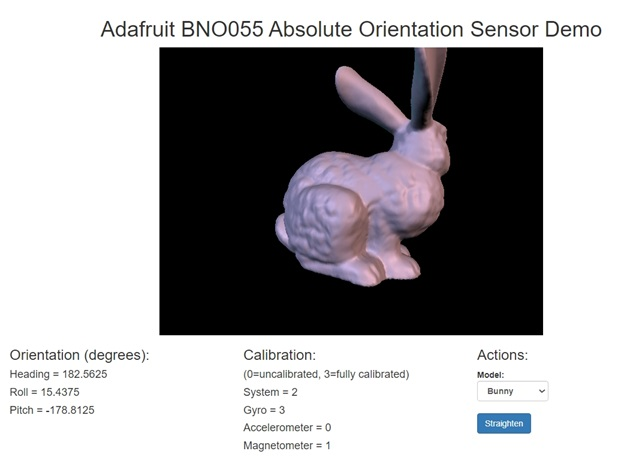
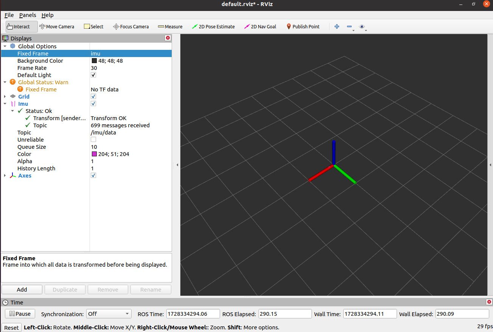

# LiDAR-experiments
Learning steps for LiDAR usage and its possibilities in conjunction with another sensors

# Inertial Measure Unit (IMU)

## Summary

* [1. Inertial Sensor 9DOF - BNO055 Presentation](#section-1)
* [2. Calibration](#section-2)
* [3. WebGL Example](#section-3)
* [4. ROS publisher](#section-4) 
* [5. Using ROS Rviz for visualization](#section-5) 

## <a name="section-1"></a> 1. Inertial Sensor 9DOF - BNO055 Presentation

A LiDAR reference system is centered on the LiDAR itself, but we aim to change the position of the sensor at the same time we update all te points coordinates, moving all of them back to the first origin of the LiDAR.

For that, we have installed on the Raspberry Pi the [Adafruit BNO055 Absolute Orientation Sensor](https://github.com/adafruit/Adafruit_CircuitPython_BNO055) - nine degree of freedom inertial measurement unit module with sensor fusion - alongside our LD14P 360º LiDAR scanner. Everything needed was found on their project page. The Pinnage was done as follows:


Depending on your system setup, you might need to ajuste SCL and SDA lines to be a bit stronger. The BNO055 has very tight timing requirements on the I2C bus, requiring short setup and rise times on the signals. 

To access the data, they provide a nice lib to make things just trivial:

```shell
ubuntu@ubiquityrobot:~$ sudo pip3 install adafruit-circuitpython-bno055
```

A simple, program like the one below can access the raw data provided by the sensor:

```Python
#!/usr/bin/python3
import adafruit_bno055
import board
import time

i2c = board.I2C()
sensor = adafruit_bno055.BNO055_I2C(i2c)
# Modes in Datasheet Table 3-3: Operating modes overview
sensor.mode = adafruit_bno055.NDOF_MODE

t_start = time.time()
timeout = 10 # seconds

while time.time() < t_start + timeout:
    print(sensor.linear_acceleration) # m/s^2 without g
    print(sensor.acceleration)        # m/s^2 with g
    print(sensor.gyro)                # radians/s
    print(sensor.magnetic)            # microteslas
```

Turning the sensor data from an accelerometer, gyroscope and magnetometer into actual "3D space orientation" is a hard problem to solve. The sensor fusion algorithms can be mind-numbingly difficult to get right and implement on low cost real time systems. The `NDOF_MODE` is a fusion mode that will digest all the sensor data, abstract the sensor fusion and real time requirements away, and spit out data you can use in quaternions, Euler angles or vectors.

Sensor fusion modes are meant to calculate measures describing the orientation of the device in space, providing the heading of the sensor as quaternion data or in Euler angles (roll, pitch and yaw).

A simple, program like the one below can access the processed data provided by the sensor:

```Python
#!/usr/bin/python3
import adafruit_bno055
import board
import time

i2c = board.I2C()
sensor = adafruit_bno055.BNO055_I2C(i2c)
# Modes in Datasheet Table 3-3: Operating modes overview
sensor.mode = adafruit_bno055.NDOF_MODE

t_start = time.time()
timeout = 10 # seconds

while time.time() < t_start + timeout:
    print("Euler angle: {}".format(sensor.euler))
    print("Quaternion: {}".format(sensor.quaternion))
```

## <a name="section-2"></a> 2. Calibration

You should discard data as long as the system calibration status is 0 <u>if you have the choice</u>. The preferred approach is to conduct a calibration dance once, then provide the offset values into the project code to preset the sensor's offset registers just after power-up. 

Presetting the magnetometer is important since reliable absolute positioning is dependent on the magnetometer knowing its geographic location relative to magnetic north. Presetting the gyroscope and accelerometer registers isn't as critical, but is a good practiceThe manufactures come up with a simple script to calibrate the sensor and save the correction.

The program below comes with the BNO library, we've change it to run the calibration and save the offset for later use at the end:

```Python
# SPDX-FileCopyrightText: 2023 JG for Cedar Grove Maker Studios
# SPDX-License-Identifier: MIT
"""
`bno055_calibrator.py`
===============================================================================
A CircuitPython module for calibrating the BNo055 9-DoF sensor. After manually
calibrating the sensor, the module produces calibration offset tuples for use
in project code.
* Author(s): JG for Cedar Grove Maker Studios
Implementation Notes
--------------------
**Hardware:**
* Adafruit BNo055 9-DoF sensor
**Software and Dependencies:**
* Driver library for the sensor in the Adafruit CircuitPython Library Bundle
* Adafruit CircuitPython firmware for the supported boards:
https://circuitpython.org/downloads
"""
import time
import board
import adafruit_bno055
# pylint: disable=too-few-public-methods
class Mode:
    CONFIG_MODE = 0x00
    ACCONLY_MODE = 0x01
    MAGONLY_MODE = 0x02
    GYRONLY_MODE = 0x03
    ACCMAG_MODE = 0x04
    ACCGYRO_MODE = 0x05
    MAGGYRO_MODE = 0x06
    AMG_MODE = 0x07
    IMUPLUS_MODE = 0x08
    COMPASS_MODE = 0x09
    M4G_MODE = 0x0A
    NDOF_FMC_OFF_MODE = 0x0B
    NDOF_MODE = 0x0C
# Uncomment these lines for UART interface connection
# uart = board.UART()
# sensor = adafruit_bno055.BNO055_UART(uart)
# Instantiate I2C interface connection
# i2c = board.I2C() # For board.SCL and board.SDA
i2c = board.STEMMA_I2C() # For the built-in STEMMA QT connection
sensor = adafruit_bno055.BNO055_I2C(i2c)
sensor.mode = Mode.NDOF_MODE # Set the sensor to NDOF_MODE
print("Magnetometer: Perform the figure-eight calibration dance.")
while not sensor.calibration_status[3] == 3:
    # Calibration Dance Step One: Magnetometer
    # Move sensor away from magnetic interference or shields
    # Perform the figure-eight until calibrated
    print(f"Mag Calib Status: {100 / 3 * sensor.calibration_status[3]:3.0f}%")
    time.sleep(1)
print("... CALIBRATED")
time.sleep(1)
print("Accelerometer: Perform the six-step calibration dance.")
while not sensor.calibration_status[2] == 3:
    # Calibration Dance Step Two: Accelerometer
    # Place sensor board into six stable positions for a few seconds each:
    # 1) x-axis right, y-axis up, z-axis away
    # 2) x-axis up, y-axis left, z-axis away
    # 3) x-axis left, y-axis down, z-axis away
    # 4) x-axis down, y-axis right, z-axis away
    # 5) x-axis left, y-axis right, z-axis up
    # 6) x-axis right, y-axis left, z-axis down
    # Repeat the steps until calibrated
    print(f"Accel Calib Status: {100 / 3 * sensor.calibration_status[2]:3.0f}%")
    time.sleep(1)
print("... CALIBRATED")
time.sleep(1)
print("Gyroscope: Perform the hold-in-place calibration dance.")
while not sensor.calibration_status[1] == 3:
    # Calibration Dance Step Three: Gyroscope
    # Place sensor in any stable position for a few seconds
    # (Accelerometer calibration may also calibrate the gyro)
    print(f"Gyro Calib Status: {100 / 3 * sensor.calibration_status[1]:3.0f}%")
    time.sleep(1)
print("... CALIBRATED")
time.sleep(1)
print("\nCALIBRATION COMPLETED")
print("Insert these preset offset values into project code:")
print(f" Offsets_Magnetometer: {sensor.offsets_magnetometer}")
print(f" Offsets_Gyroscope: {sensor.offsets_gyroscope}")
print(f" Offsets_Accelerometer: {sensor.offsets_accelerometer}")
## Save
with open('offsets_m_g_a.txt', 'w') as file:
    m = " ".join([str(i) for i in sensor.offsets_magnetometer])
    g = " ".join([str(i) for i in sensor.offsets_gyroscope])
    a = " ".join([str(i) for i in sensor.offsets_accelerometer])
    file.write(m+'\n')
    file.write(g+'\n')
    file.write(a)
```
Run it:

```shell
ubuntu@ubiquityrobot:~$ python3 bno055_calibrator.py
Magnetometer: Perform the figure-eight calibration dance.
Mag Calib Status:   0%
Mag Calib Status:   0%
Mag Calib Status:  33%
Mag Calib Status:  33%
Mag Calib Status:  67%
Mag Calib Status:  67%
... CALIBRATED
Accelerometer: Perform the six-step calibration dance.
Accel Calib Status:   0%
Accel Calib Status:   0%
Accel Calib Status:   0%
Accel Calib Status:  33%
Accel Calib Status:  33%
Accel Calib Status:  67%
... CALIBRATED
Gyroscope: Perform the hold-in-place calibration dance.
... CALIBRATED True

CALIBRATION COMPLETED
Insert these preset offset values into project code:
 Offsets_Magnetometer: (-45, -44, 194)
 Offsets_Gyroscope: (1, 0, -1)
 Offsets_Accelerometer: (-2, -67, 20)
```

Repeating the calibration process produces some variance in the offset values, but the scale and magnitude are usually close. Since the sensor is continuously calibrating, close is good enough for most projects. The primary benefit of calibrating the sensor once using the stand-alone code is that the project application begins with a useful orientation from the get-go and won't require a calibration dance recital for each power-on startup.

## <a name="section-3"></a> 3. WebGL Example

There ia an example on how to send orientation readings to a webpage and use it to rotate a 3D model!

Install dependecies and run with:

```shell
ubuntu@ubiquityrobot:~$ sudo apt-get install python3-flask
ubuntu@ubiquityrobot:~$ git clone https://github.com/adafruit/Adafruit_CircuitPython_BNO055.git
ubuntu@ubiquityrobot:~$ cd Adafruit_CircuitPython_BNO055/examples/bno055_webgl_demo 
ubuntu@ubiquityrobot:~/Adafruit_CircuitPython_BNO055/examples/bno055_webgl_demo$ sudo python3 server.py
 * Serving Flask app "server" (lazy loading)
 * Environment: production
   WARNING: This is a development server. Do not use it in a production deployment.
   Use a production WSGI server instead.
 * Debug mode: on
 * Running on http://0.0.0.0:5000/ (Press CTRL+C to quit)
 * Restarting with stat
 * Debugger is active!
 * Debugger PIN: 308-698-291
```

Next, navigate `http://[RASPBERRY_IP]:5000/`. In my case `http://192.168.1.20:5000/`.



## <a name="section-4"></a> 4. ROS publisher

https://automaticaddison.com/how-to-publish-imu-data-using-ros-and-the-bno055-imu-sensor/

Install dependencies:

```shell
ubuntu@ubiquityrobot:~$ 
sudo apt-get install libi2c-dev

mkdir -p bno055_ros_ws/src && cd bno055_ros_ws/src/

git clone https://github.com/dheera/ros-imu-bno055.git

cd ~/bno055_ros_ws/

catkin_make --only-pkg-with-deps imu_bno055

source ~/bno055_ros_ws/devel/setup.bash

echo "source ~/bno055_ros_ws/devel/setup.bash" >> ~/.bashrc
```

From now on you can run the publisher just by:

```shell
ubuntu@ubiquityrobot:~$ roslaunch imu_bno055 imu.launch
... logging to /home/ubuntu/.ros/log/c2205b98-84e0-11ef-ae26-b827ebe94c24/roslaunch-ubiquityrobot-1311.log
Checking log directory for disk usage. This may take a while.
Press Ctrl-C to interrupt
Done checking log file disk usage. Usage is <1GB.

started roslaunch server http://ubiquityrobot.local:33023/

SUMMARY
========

PARAMETERS
 * /imu/imu_node/address: 40
 * /imu/imu_node/device: /dev/i2c-1
 * /imu/imu_node/frame_id: imu
 * /rosdistro: noetic
 * /rosversion: 1.15.15

NODES
  /imu/
    imu_node (imu_bno055/bno055_i2c_node)

ROS_MASTER_URI=http://ubiquityrobot:11311

process[imu/imu_node-1]: started with pid [1325]      
rev ids: accel:251 mag:50 gyro:15 sw:913 bl:149  
```

As we can see, there is one node runnig, `/imu/imu_node` . Check it with:


```shell
ubuntu@ubiquityrobot:~$ rosnode info /imu/imu_node
Node [/imu/imu_node]
Publications:
 * /imu/data [sensor_msgs/Imu]
 * /imu/mag [sensor_msgs/MagneticField]
 * /imu/raw [sensor_msgs/Imu]
 * /imu/temp [sensor_msgs/Temperature]
 * /rosout [rosgraph_msgs/Log]
...
 ```

From the [developers site](https://github.com/dheera/ros-imu-bno055) we can check the topic `imu/data` is the fused IMU data. You can check the message structure of each topic by:

```shell
ubuntu@ubiquityrobot:~$ rosmsg show sensor_msgs/Imu
std_msgs/Header header
  uint32 seq
  time stamp
  string frame_id
geometry_msgs/Quaternion orientation
  float64 x
  float64 y
  float64 z
  float64 w
float64[9] orientation_covariance
geometry_msgs/Vector3 angular_velocity
  float64 x
  float64 y
  float64 z
float64[9] angular_velocity_covariance
geometry_msgs/Vector3 linear_acceleration
  float64 x
  float64 y
  float64 z
float64[9] linear_acceleration_covariance
 ```

As we can see, we can either get (x,y,z,w) of the quaternion or the angular velocity (rad/s) or the linear acceleration without the gravity (m/s²). We can convert the quaternion to euler angles (roll, pitch, yaw) later.

Let's check `/imu/data` topic:

```shell
ubuntu@ubiquityrobot:~$ rostopic echo /imu/data
---
header: 
  seq: 137346
  stamp:
    secs: 1728332969
    nsecs: 974644754
  frame_id: "imu"
orientation:
  x: 0.688229732395788
  y: 0.7170992484851112
  z: 0.052551064171051216
  w: 0.0966793096944775
orientation_covariance: [0.0, 0.0, 0.0, 0.0, 0.0, 0.0, 0.0, 0.0, 0.0]
angular_velocity:
  x: 0.14
  y: -0.04888888888888889
  z: -0.2966666666666667
angular_velocity_covariance: [0.0, 0.0, 0.0, 0.0, 0.0, 0.0, 0.0, 0.0, 0.0]
linear_acceleration:
  x: 0.0
  y: -0.11
  z: -0.13
linear_acceleration_covariance: [0.0, 0.0, 0.0, 0.0, 0.0, 0.0, 0.0, 0.0, 0.0]
---
...
 ```

Press Ctrl+c to stop the messages.

## <a name="section-5"></a> 5. Using ROS Rviz for visualization

From another computer with an actual desktop installed we can acces trough ROS rviz program

 ```shell
ub20@ub20-VM:~$ env | grep ROS_MASTER
ROS_MASTER_URI=http://192.168.1.20:11311
ub20@ub20-VM:~$ rviz
[ INFO] [1728334003.358305873]: rviz version 1.14.25
[ INFO] [1728334003.358400664]: compiled against Qt version 5.12.8
[ INFO] [1728334003.358408686]: compiled against OGRE version 1.9.0 (Ghadamon)
[ INFO] [1728334003.406470670]: Forcing OpenGl version 0.
[ INFO] [1728334003.636953645]: Stereo is NOT SUPPORTED
[ INFO] [1728334003.637029722]: OpenGL device: llvmpipe (LLVM 12.0.0, 128 bits)
[ INFO] [1728334003.637052601]: OpenGl version: 3,1 (GLSL 1,4).

 ```

Change the fixed frame to `imu` >> Click the Add button in the bottom left >> Click imu under rviz_imu_plugin >> Click OK >> Change the topic of the imu to `/imu/data`. 

You the axis are attached to the sensor.



<!-- 
git init
git remote add origin https://github.com/HumbertoDiego/lidar-experiments
git pull origin main
#Do changes
git add * ; git commit -m "update Readme and files"; git push -u origin main
 -->
