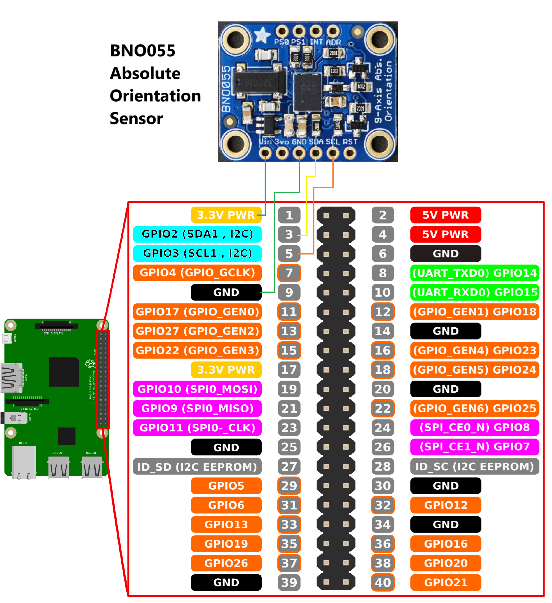

# LiDAR-experiments
Learning steps for LiDAR usage and its possibilities in conjunction with another sensors

# Inertial Measure Unit (IMU)

## Summary

* [1. Inertial Sensor 9DOF - BNO055 Presentation](#section-1)

## <a name="section-1"></a> 1. Inertial Sensor 9DOF - BNO055 Presentation

The LiDAR Data reference system is centered on the LiDAR itself, but we aim to change the position of the sensor at the same time we update all te points coordinates, moving all of them back to the first origin of the LiDAR.

For that, we have installed on the Raspberry Pi the [Adafruit BNO055 Absolute Orientation Sensor](https://github.com/adafruit/Adafruit_CircuitPython_BNO055) - nine degree of freedom inertial measurement unit module with sensor fusion - alongside our LD14P 360º LiDAR scanner. Everything needed was found on their project page. The Pinnage was done as follows:



To access the data, they provide a nice lib to make things just trivial:

```shell
ubuntu@ubiquityrobot:~$ sudo pip3 install adafruit-circuitpython-bno055
```

A simple, program like the one below can access the data provided by the sensor:

```Python
#!/usr/bin/python3
import adafruit_bno055
import board
import time

i2c = board.I2C()
sensor = adafruit_bno055.BNO055_I2C(i2c)
# Modes in Datasheet Table 3-3: Operating modes overview
sensor.mode = adafruit_bno055.NDOF_MODE

t_start = time.time()
timeout = 10 # seconds

while time.time() < t_start + timeout:
    print(sensor.linear_acceleration) # m/s without gravity
    print(sensor.acceleration)        # m/s with gravity
    print(sensor.gyro)                # radians/s
    print(sensor.magnetic)            # microteslas
   
```

<!-- 
git init
git remote add origin https://github.com/HumbertoDiego/lidar-experiments
git pull origin main
#Do changes
git add * ; git commit -m "update Readme and files"; git push -u origin main
 -->
