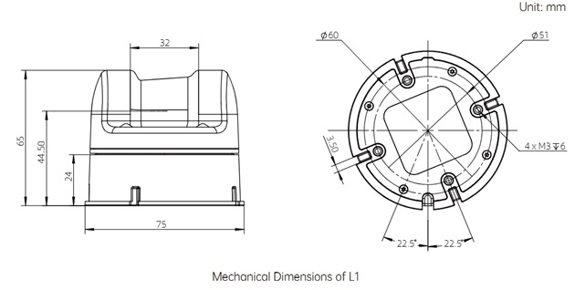
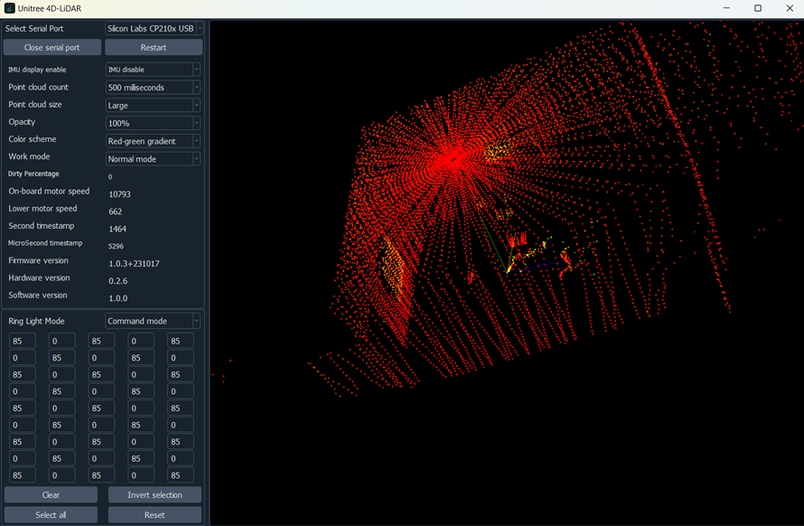

# LiDAR-experiments
Learning steps for LiDAR usage and its possibilities in conjunction with another sensors

## Summary

* [1. Lidar 360ºx90º - Unitree 4D L1 RM Presentation](#section-1)
* [2. Installation on Windows via USB](#section-2)

##  1. Lidar 360ºx90º - Unitree 4D L1 RM Presentation

There are a lot of 360° LIDAR out there, but not like this one, we will be using here the **Unitree 4D LiDAR L1 RM** from [Unitree Robotics](https://www.unitree.com/). It's specs:

- 4D LiDAR: 3D Position + 1D Grayscale:
- Max Range: 30M（L1 RM @90% reflectity，15M（L1 RM @10% reflectity）
- Horizontal Scanning Frequency: 11Hz
- Vertical Scanning Frequency: 180Hz
- Effective Frequency: 21600 points/s
- IMU Reporting Frequency: 250Hz

Has support for ROS1, ROS2, Python routines that run on Ubuntu and Windows. Following the manufacturer instructions to have it running. 

##  2. Installation on Windows via USB

After download [Driver and Unilidar software](https://www.unitree.com/download), just plug the 4-pin serial port of the L1 and The 12V power supply into the adapter module. Then, from the adaptor to your PC. Open the Unilidar software, choose the COM port and Click on "Open Serial Port" and you should se something like this:

<!-- Pretty quick huh.  -->