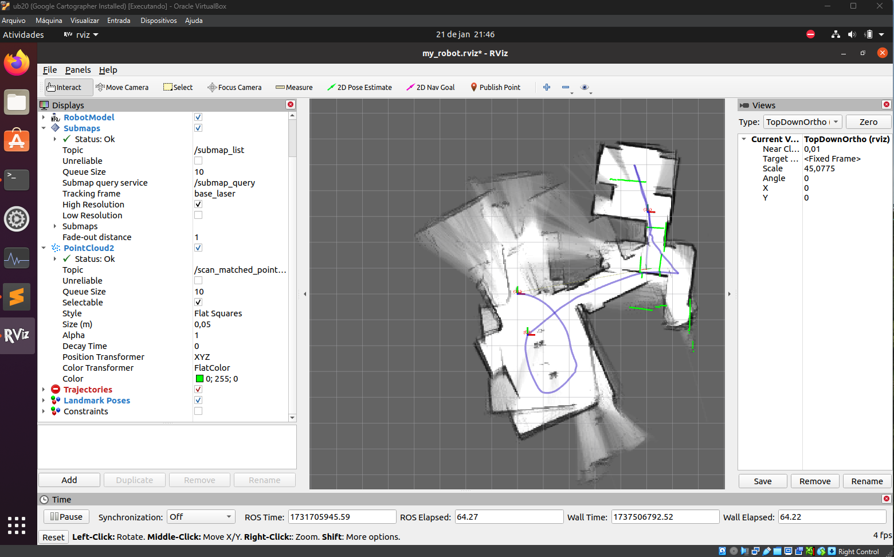

# LiDAR-experiments
Learning steps for LiDAR usage and its possibilities in conjunction with another sensors

# 2D LiDAR + IMU

## Summary

* [1. The problem with LiDAR point cloud registration](#section-1)
* [2. Sensors arrangement and setup](#section-2)
    * [2.1 A ROS publisher to synchronize IMU and LiDAR messages](#section-21)
    * [2.2 Rosbag file generation](#section-22)
* [3. Ubuntu Focal + ROS Noetic + Google Cartographer](#section-3)
    * [3.1 Google Cartographer installation](#section-31)
    * [3.2 Google Cartographer usage with rosbag file](#section-32)

## <a name="section-1"></a> 1. The problem with LiDAR point cloud registration

Several real worlds problems can lead to alignment drift in our registration over time. We can check our previous ~~failures~~ results <a href="imgs/scatter_animation1.mp4">here</a> and <a href="imgs/scatter_animation2.mp4">here</a>, if not using global loop closure or any other sensor to increase our pose confidence. Below we list the noticed problems:

- **Accumulated Error**: ICP aligns each new LiDAR scan relative to the last one (or a map built incrementally). Over time, small alignment errors are accumulated becoming substantial.
- **Local minima**: ICP relies on minimizing a cost function that matches point clouds. If the initial guess is poor or the overlap between scans is low, it can converge to incorrect solutions.
- **Insufficient Constraints**: ICP uses geometric features (e.g., points or surfaces) without considering global constraints. Without external references like loop closures or GPS, drift is inevitable
- **Environment Dependence**: Some environments lack distinctive geometric features, making it challenging for ICP to establish reliable correspondences. Examples include: 
  - Homogeneous environments: Open fields, hallways.
  - Feature-poor areas: Smooth surfaces, large walls.
- **Motion Distortion**: If the LiDAR is mounted on a moving platform (e.g., a robot or car), motion during data capture can distort the point cloud. Without compensating for this motion, ICP operates on inaccurate input data.
- **Dynamic Environments**: ICP assumes a static environment, but real-world environments often include moving objects (e.g., cars, pedestrians) that distort the point cloud and mislead the registration process.

The Mitigation Strategies are:
- **Combine with Other Sensors**: IMUs, cameras or GPS.
- **Global Optimization**: Loop Closure and Pose Graph SLAM.
- **Improved Algorithms**: Use variants of ICP like Generalized-ICP (GICP) or Normal Distributions Transform (NDT) that include probabilistic models for alignment. Use robust outlier rejection techniques to reduce errors caused by dynamic objects.

Here, we approach the problem using the LiDAR combined with IMU.

## <a name="section-2"></a> 2. Sensors arrangement and setup

We start with the Raspberry Access point and the two interest ROS nodes published. One node runnig the LiDAR `/pointcloud2d` topic and another runnig the IMU `/imu/data` topic. Go back to [1. LD14P -> LiDAR 360º](1-LD14P.md) and [2. BNO055 -> Inertial Measurement Unit 9DOF](2-BNO055.md) for more details.

Requirements:

* LD14P 360º LiDAR
* BNO055 IMU
* Raspiberry Pi model 3B
* RC car
* Uninterruptible Power Supply (UPS) 5V - 3A like [UPS Module 3S](https://www.waveshare.com/wiki/UPS_Module_3S)
* Sd card with [2023-02-09-ubiquity-base-focal-raspberry-pi.img](https://learn.ubiquityrobotics.com/noetic_pi_image_downloads) installed
* Internet connection plugged in via Ethernet cable (only initial steps)

Setup everything on top of the Remote Control Car:


### <a name="section-21"></a> 2.1 A ROS publisher to synchronize IMU and LiDAR messages

Knowing the quaternion form is $q = w + xi + yj + zk$  or $q = q_0 + q_1i + q_2j + q_3k$, we aim to use this information to generate the Rotation matrix using the formula:

$$
R(q ) = 
\begin{bmatrix}
2(q_0^2 + q_1^2)-1 & 2(q_1q_2 - q_0q_3) & 2(q_1q_3 + q_0q_2) \\
2(q_1q_2 + q_0q_3) & 2(q_0^2 + q_2^2)-1 & 2(q_2q_3 - q_0q_1) \\
2(q_1q_3 - q_0q_2) & 2(q_2q_3 + q_0q_1) & 2(q_0^2 + q_3^2)-1 \\
\end{bmatrix}
$$

Create `./imu_lidar_publisher.py` with:

```Python
#!/usr/bin/python3

import rospy
from std_msgs.msg import String
from sensor_msgs.msg import PointCloud, Imu
from message_filters import Subscriber, TimeSynchronizer, ApproximateTimeSynchronizer

def add_increment_to_timestamp(timestamp, increment, size):
    return [timestamp+i*increment for i in range(size)]

def put_together(timestamps, quats, seq, points):
    return f"{timestamps},{quats.w},{quats.x},{quats.y},{quats.z},{seq},{points.x},{points.y},{points.z}\n"

# Callback function to process synchronized messages
def callback(cloud_msg, imu_msg):
    # Get LiDAR x,y,z
    points = cloud_msg.points
    # Get LiDAR cloud number
    cloud_numbers = [cloud_msg.header.seq for _ in range(len(points))]
    # Get LiDAR timestamps
    initial_timestamp = cloud_msg.header.stamp.secs + cloud_msg.header.stamp.nsecs/1000000000
    timeincrement = cloud_msg.channels[1].values[0]
    timestamps = add_increment_to_timestamp(initial_timestamp, timeincrement, len(points))
    # Get IMU quaternion
    quats = [imu_msg.orientation for _ in range(len(points))]
    # setup new message
    msg = "".join(list(map(put_together,quats,cloud_numbers,points)))
    #rospy.loginfo(f"{msg}")
    pub.publish(joined_data)

if __name__ == '__main__':
    # Initialize the node
    rospy.init_node('imu_lidar_joiner_node')

    # Define the publisher
    pub = rospy.Publisher('imu_lidar_joined_topic', String, queue_size=10)

    # Define the subscribers
    sub1 = Subscriber('/pointcloud2d', PointCloud)
    sub2 = Subscriber('/imu/data', Imu)

    # Synchronize the subscribers
    ts = ApproximateTimeSynchronizer([sub1, sub2], queue_size=10, slop=0.1) #TimeSynchronizer([sub1, sub2], queue_size=10)
    ts.registerCallback(callback)

    # Keep the node running
    rospy.loginfo("PointCloud2 and IMU processor node started.")
    rospy.spin()
```

Run all nodes on ROS MASTER:

```shell
ubuntu@ubiquityrobot:~$ roslaunch ldlidar_sl_ros ld14p.launch &
...
ubuntu@ubiquityrobot:~$ roslaunch imu_bno055 imu.launch &
...
ubuntu@ubiquityrobot:~$ ./imu_lidar_publisher.py &
[INFO] [1731695040.521639]: PointCloud2 and IMU processor node started.
```

From a remote ROS create a `/imu_lidar_joined_topic` subscriber, name it `./imu_lidar_subscriber.py`, to save data for posterior analisys:

```Python
#!/usr/bin/python3
import rospy
from std_msgs.msg import String

frame = 0
def callback(msg):
    global frame
    print("-->",frame)
    frame += 1
    # save
    with open("t_q1_q2_q3_q0_seq_x_y_z.csv", "a") as f:
        f.write(msg.data)

if __name__ == '__main__':
    rospy.init_node('listener', anonymous=True)
    rospy.Subscriber("/imu_lidar_joined_topic", String, callback)
    rospy.spin()
```

Check if enviroment variables are correct and run it:

```shell
# Check env from ROS MASTER
ubuntu@ubiquityrobot:~$ env | grep ROS
ROS_VERSION=1
ROS_PYTHON_VERSION=3
ROS_PACKAGE_PATH=/home/ubuntu/bno055_ros_ws/src:/home/ubuntu/ldlidar_ros_ws/src:/opt/ros/noetic/share       
ROSLISP_PACKAGE_DIRECTORIES=/home/ubuntu/bno055_ros_ws/devel/share/common-lisp:/home/ubuntu/ldlidar_ros_ws/devel/share/common-lisp
ROS_IP=10.42.0.1
ROS_ETC_DIR=/opt/ros/noetic/etc/ros
ROS_MASTER_URI=http://ubiquityrobot:11311
ROS_HOSTNAME=ubiquityrobot.local
ROS_ROOT=/opt/ros/noetic/share/ros
ROS_DISTRO=noetic
# Check env from ROS REMOTE
ub20@ub20-VM:~$ env | grep ROS
ROS_VERSION=1
ROS_PYTHON_VERSION=3
ROS_PACKAGE_PATH=/opt/ros/noetic/share
ROS_IP=10.42.0.1
ROS_ETC_DIR=/opt/ros/noetic/etc/ros
ROS_MASTER_URI=http://10.42.0.1:11311
ROS_ROOT=/opt/ros/noetic/share/ros
ROS_DISTRO=noetic
# Run the imu lidar subscriber on ROS remote
ub20@ub20-VM:~$ ./imu_lidar_subscriber.py 
--> 0
--> 1
--> 2
--> 3
--> 4
--> 5
--> 6
--> 7
--> 8
--> 9
--> 10
```

Further usage of these quaternions with xyz point in [ICP applied on moderate dataset](<Theory 2.3-ICPLiDAR_IMUDataset.ipynb>).

### <a name="section-22"></a> 2.2 Rosbag file generation

When the desired nodes and topics are published, we can record them for latter usage with:

```shell
ubuntu@ubiquityrobot:~$ rostopic list 
/imu/data
/imu/mag
/imu/raw
/imu/status
/imu/temp
/pointcloud2d
/rosout
/rosout_agg
/scan
/tf
ubuntu@ubiquityrobot:~$ rosbag record -a # record all topics
[ INFO] [1731700713.944753099]: Recording to '2024-11-15-19-58-33.bag'.
...
```

When the message recording is complete, end the command line with ctrl + c to terminate the recording proccess, the `YYYY-MM-DD-hh-mm-ss.bag` file will be created. One can check details of the record by:

```shell
ubuntu@ubiquityrobot:~$ rosbag info 2024-11-15-19-58-33.bag
path:        2024-11-15-19-58-33.bag
version:     2.0
duration:    51.7s
start:       Nov 15 2024 19:58:34.08 (1731700714.08)
end:         Nov 15 2024 19:59:25.73 (1731700765.73)
size:        10.0 MB
messages:    22339
compression: none [13/13 chunks]
types:       diagnostic_msgs/DiagnosticStatus [d0ce08bc6e5ba34c7754f563a9cabaf1]
             rosgraph_msgs/Log                [acffd30cd6b6de30f120938c17c593fb]
             sensor_msgs/Imu                  [6a62c6daae103f4ff57a132d6f95cec2]
             sensor_msgs/LaserScan            [90c7ef2dc6895d81024acba2ac42f369]
             sensor_msgs/MagneticField        [2f3b0b43eed0c9501de0fa3ff89a45aa]
             sensor_msgs/PointCloud           [d8e9c3f5afbdd8a130fd1d2763945fca]
             sensor_msgs/Temperature          [ff71b307acdbe7c871a5a6d7ed359100]
             tf2_msgs/TFMessage               [94810edda583a504dfda3829e70d7eec]
topics:      /imu/data       5146 msgs    : sensor_msgs/Imu
             /imu/mag        5146 msgs    : sensor_msgs/MagneticField
             /imu/raw        5146 msgs    : sensor_msgs/Imu
             /imu/status      103 msgs    : diagnostic_msgs/DiagnosticStatus
             /imu/temp       5146 msgs    : sensor_msgs/Temperature
             /pointcloud2d    308 msgs    : sensor_msgs/PointCloud
             /rosout            8 msgs    : rosgraph_msgs/Log
             /scan            308 msgs    : sensor_msgs/LaserScan
             /tf             1028 msgs    : tf2_msgs/TFMessage
```

Retrieve bagfile and replay it on ROS Remote:

```shell
ub20@ub20-VM:~$ scp ubuntu@10.42.0.1:/home/ubuntu/2024-11-15-19-58-33.bag .
ub20@ub20-VM:~$ roscore
# Open another terminal:
ub20@ub20-VM:~$ rosbag play 2024-11-15-19-58-33.bag
[ INFO] [1731700889.494625728]: Opening 2024-11-15-19-58-33.bag

Waiting 0.2 seconds after advertising topics... done.

Hit space to toggle paused, or 's' to step.
 [RUNNING]  Bag Time: 1731700717.824701   Duration: 3.747074 / 51.652768               4
```

More on [rosbag command-line tool](https://wiki.ros.org/rosbag/Commandline).

## <a name="section-3"></a> 3. Ubuntu Focal + ROS Noetic + Google Cartographer

We aim to replay the rosbag file on a [Google Cartographer](https://google-cartographer-ros.readthedocs.io/en/latest/) node to check the results. We are already using a Ubuntu 20.04 Focal Virtual Machine but due to compatibility issues it may be necessary to restart on a fresh VM. Grab the iso at [Ubuntu Releases - Focal](https://www.releases.ubuntu.com/focal/).

After VM installation, open Ubuntu terminal and install ROS Noetic with the commands below. Also [single line command](https://wiki.ros.org/ROS/Installation/TwoLineInstall/) should work.

```shell
# Installing ROS Noetic...
ub20@ub20-VM:~$ 
sudo sh -c 'echo "deb http://packages.ros.org/ros/ubuntu $(lsb_release -sc) main" > /etc/apt/sources.list.d/ros-latest.list'
sudo apt install -y curl
curl -s https://raw.githubusercontent.com/ros/rosdistro/master/ros.asc | sudo apt-key add -
sudo apt update
sudo apt install -y ros-noetic-desktop-full
source /opt/ros/noetic/setup.bash
echo "source /opt/ros/noetic/setup.bash" >> ~/.bashrc
# Check enviroment variables:
env | grep ROS
    ROS_VERSION=1
    ROS_PYTHON_VERSION=3
    ROS_PACKAGE_PATH=/opt/ros/noetic/share
    ROS_ETC_DIR=/opt/ros/noetic/etc/ros
    ROS_MASTER_URI=http://localhost:11311
    ROS_ROOT=/opt/ros/noetic/share/ros
    ROS_DISTRO=noetic
```

### <a name="section-31"></a> 3.1 Google Cartographer installation

```shell
# Installing Cartographer for ROS Noetic...
ub20@ub20-VM:~$ 
sudo apt-get install -y python3-wstool python3-rosdep ninja-build stow
mkdir -p ~/catkin_ws/src
cd ~/catkin_ws

ub20@ub20-VM:~/catkin_ws$ 
wstool init src
wstool merge -t src https://raw.githubusercontent.com/cartographer-project/cartographer_ros/master/cartographer_ros.rosinstall
wstool update -t src
sudo rosdep init || echo "rosdep already initialized"
rosdep update
rosdep install -r --from-paths src --ignore-src --rosdistro=${ROS_DISTRO} -y
src/cartographer/scripts/install_abseil.sh
catkin_make_isolated --install --use-ninja
source ~/catkin_ws/install_isolated/setup.bash
echo "source ~/catkin_ws/install_isolated/setup.bash" >> ~/.bashrc
```

A script to install ROS Noetic and Google Cartographer package on Ubuntu Focal can be found [here](https://github.com/HumbertoDiego/lidar-experiments/blob/main/scripts/install_ros_cartographer.sh).

### <a name="section-32"></a> 3.2 Google Cartographer usage with rosbag file

To warm up, try running Cartographer with their 2d demo bag file:

```shell
ub20@ub20-VM:~$ wget -P ~/Downloads https://storage.googleapis.com/cartographer-public-data/bags/backpack_2d/cartographer_paper_deutsches_museum.bag
ub20@ub20-VM:~$ roslaunch cartographer_ros demo_backpack_2d.launch bag_filename:=${HOME}/Downloads/cartographer_paper_deutsches_museum.bag
```


Next, connect to the Raspberry Access Point (our ROS MASTER), ssh into ubiquity OS, record and retrieve a rosbag file. Let us validate the bagfile:

```shell
ub20@ub20-VM:~$ cartographer_rosbag_validate -bag_filename your_bag.bag # Look up for E messages.
...
E0116 13:17:43.513145  2832 rosbag_validate_main.cc:316] Sensor with frame_id "imu" jumps backwards in time, i.e. timestamps are not strictly increasing. Make sure that the bag contains the data for each frame_id sorted by header.stamp, i.e. the order in which they were acquired from the sensor.
...
E0116 13:17:43.513284  2832 rosbag_validate_main.cc:327] frame_id "imu" is send on multiple topics. It was seen at least on /imu/data and /imu/raw
...
E0116 13:17:43.538033  2832 rosbag_validate_main.cc:366] Average IMU linear acceleration is 5.30466 m/s^2, expected is [9.5, 10.5] m/s^2. Linear acceleration data should include gravity and be given in m/s^2.
...
E0116 13:39:46.803835  3543 rosbag_validate_main.cc:160] Sensor with frame_id "base_laser" is not sequential in time.Previous range message ends at time 638673010564806257, current one at time 638673010564806245
...
E0116 13:17:43.538071  2832 rosbag_validate_main.cc:383] Point data (frame_id: "base_laser") has a large gap, largest is 0.333317 s, recommended is [0.0005, 0.05] s with no jitter.

```

The IMU related errors can be corrected by recording just one `/sensor_msgs/Imu` and include the one with gravity `/imu/raw`. The Laser error not sequential can be corrected by recording just `/scan`. Follow the advices and record again with:

```shell
ubuntu@ubiquityrobot:~$ rosbag record -O my_robot.bag /imu/raw /scan
```

Next, make a `.launch` and `.lua` configuration files similar to Revo Laser Distance `demo_revo_lds.launch` and `revo_lds.lua` and change it accordingly:

```shell
ub20@ub20-VM:~$ 
cp catkin_ws/install_isolated/share/cartographer_ros/launch/demo_revo_lds.launch catkin_ws/install_isolated/share/cartographer_ros/launch/my_robot.launch

cp catkin_ws/install_isolated/share/cartographer_ros/configuration_files/revo_lds.lua catkin_ws/install_isolated/share/cartographer_ros/configuration_files/my_robot.lua

nano catkin_ws/install_isolated/share/cartographer_ros/launch/my_robot.launch
# Change
-configuration_basename revo_lds.lua
# To
-configuration_basename my_robot.lua
# Change
<remap from="scan" to="horizontal_laser_2d" />
# To
<remap from="imu" to="imu/raw" />

nano catkin_ws/install_isolated/share/cartographer_ros/configuration_files/my_robot.lua
# Change
horizontal_laser_link
# To
base_laser
```

Other options for the `.lua` file:

- num_laser_scans: Number of `sensor_msgs/LaserScan` topics you’ll use. Set 1.
- num_multi_echo_laser_scans: Number of `sensor_msgs/MultiEchoLaserScan` topics you’ll use. Set 0.
- num_point_clouds: Number of `sensor_msgs/PointCloud2` topics you’ll use. Set 0.
- TRAJECTORY_BUILDER_2D.num_accumulated_range_data: Number of messages required to construct a full scan (typically, a full revolution). Set 1.

This configuration expects a `bag_filename` argument to replay data from a recording (check playbag node) and also spawns a rviz window configured to visualize Cartographer's state (check rviz node).

The files [my_robot.launch](https://github.com/HumbertoDiego/lidar-experiments/blob/main/scripts/my_robot.launch), [my_robot.lua](https://github.com/HumbertoDiego/lidar-experiments/blob/main/scripts/my_robot.lua), [my_robot.rviz](https://github.com/HumbertoDiego/lidar-experiments/blob/main/scripts/my_robot.rviz), [my_robot.urdf](https://github.com/HumbertoDiego/lidar-experiments/blob/main/scripts/my_robot.urdf) and the [my_robot.bag](https://github.com/HumbertoDiego/lidar-experiments/blob/main/sample_data/min.bag) are available to download. Run cartographer_ros without IMU usage with:

```shell
ub20@ub20-VM:~$ roslaunch cartographer_ros my_robot.launch bag_filename:=/home/ub20/my_robot.bag
```



The results with IMU were worse. But to run it, just uncomment `robot_description` inside `my_robot.launch` and change `TRAJECTORY_BUILDER_2D.use_imu_data = false` to `true` inside `my_robot.lua`.  

<!-- 
git add * ; git commit -m "update lidar imu files"; git push -u origin main
 -->