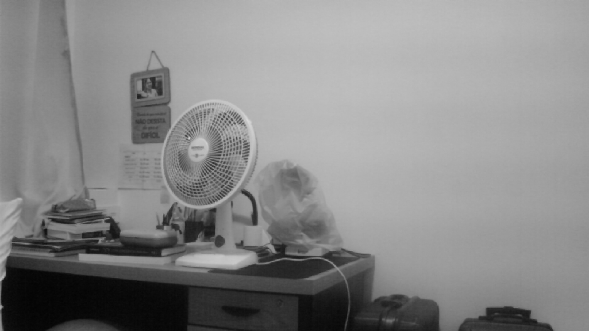

# LiDAR-experiments
Learning steps for LiDAR usage and its possibilities in conjunction with another sensors

# Stereo Cheap Cameras

## Summary

* [1. Cameras arrangement and setup](#section-1)
* [2. Cheap cameras specs](#section-2)
* [3. Cameras calibration](#section-3)
* [4. Simple Stereo example](#section-4)
* [5. Run OpenCV photo caputres in loop](#section-5)
* [6. Cameras rearrangement](#section-6)

## <a name="section-1"></a> 1. Cameras arrangement and setup

There are a lot o ~~shit~~ cheap cameras out there, how far with stereo pair quality images we can go with them? The key factor is dataset quality, in math terms, we want a lot of good keypoints found between images stereo pairs and it's next frames. Making videos with all cameras at fixed positions in relation to one another is our goal here. We start presenting the cameras arragement:

<p float="left">


</p>

Were y-axis is the vertical, x-axis is the horizontal orthogonal to the direction of motion and z-axis is the horizontal in the direction of motion.

The initial setup is on top of a metal frame of a Brazilian Army Campaign Backpack, the computer is a [Raspberry Pi 3B](https://www.raspberrypi.com/products/). It's main purpose is to collect the images and share it's folder over the network.

Requirements:

* Raspiberry Pi model 3b
* 2 Cheap Cameras over USB
* 1 Cheap Camera over CSI
* Power Bank
* Sd card with [2023-02-09-ubiquity-base-focal-raspberry-pi.img](https://learn.ubiquityrobotics.com/noetic_pi_image_downloads) installed
* Internet connection plugged in via Ethernet cable (only initial steps)

### SSH connection to Raspberry pi

With this Ubiquity image, the wifi adapter of the Raspberry Pi acts as an Access Point, so we just need to enter `ubiquityrobotXXXX` network, where XXXX is part of the MAC address. The password is `robotseverywhere`. The sudo username is `ubuntu` with password `ubuntu`. 

In this network, just run on a shell:

```shell
> ssh ubuntu@10.42.0.1 # enter password
# Check your Raspberry IP over all networks
ubuntu@ubiquityrobot:~$ ip a | grep "inet "
    inet 127.0.0.1/8 scope host lo
    inet 192.168.1.20/24 brd 192.168.1.255 scope global enxb827ebe94c24
    inet 10.42.0.1/24 brd 10.42.0.255 scope global noprefixroute wlan0
```

### Take 1st picture with `fswebcam`

```shell
ubuntu@ubiquityrobot:~$ sudo apt update && sudo apt install fswebcam
ubuntu@ubiquityrobot:~$ fswebcam --no-banner imageX.jpg
fswebcam --no-banner imageX.jpg
--- Opening /dev/video0...
Trying source module v4l2...
/dev/video0 opened.
No input was specified, using the first.
--- Capturing frame...
Captured frame in 0.00 seconds.
--- Processing captured image...
Disabling banner.
Writing JPEG image to 'imageX.jpg'.
```

Notice the `/dev/video0`, you can choose the camera by change the device name with:

```shell
ubuntu@ubiquityrobot:~$ fswebcam --no-banner --device /dev/video0 image0.jpg
```

### Take 1st picture with `ffmeg`

```shell
ubuntu@ubiquityrobot:~$ sudo apt update && sudo apt install ffmpeg
ubuntu@ubiquityrobot:~$ ffmpeg -y -f v4l2 -video_size 1280x720 -i /dev/video0 -r 0.2 -qscale:v 2 -update 1 ~/webcam.jpg
```

The non trivial options of this command are `-r 0.2`: set FPS to 0.2 or 1 frame per 5 seconds,`-qscale:v 2`: set video quality [JPEG quality in this case], 2 is highest quality and `-update 1`: Enable in place update of image file for each video output frame, the ffmpeg command will run until interrupted with Ctrl+c or killed, this option generates better images, instead you can use `-frames:v 1` to generate a single frame file, but the result is more darker in low lights environments. 

### Generate 1st video with `ffmeg`

```shell
ubuntu@ubiquityrobot:~$ ffmpeg -y -f v4l2 -r 25 -video_size 640x480 -i /dev/video0 output.mkv
```

### Stream the camera over network with `v4l2rtspserver`

We will setup here a Real Time Streaming Protocol (RTSP) server for our cameras, let's start by installing the [v4l2rtspserver](https://github.com/mpromonet/v4l2rtspserver), we will have to go back to version 0.2.4 due to compatibility issues with our Ubuntu 20.04:

```shell
ubuntu@ubiquityrobot:~$ wget https://github.com/mpromonet/v4l2rtspserver/releases/download/v0.2.4/v4l2rtspserver-0.2.4-Linux-armv7.deb
ubuntu@ubiquityrobot:~$ apt install ./v4l2rtspserver-0.2.4-Linux-armv7.deb
# run the server in background with
ubuntu@ubiquityrobot:~$ v4l2rtspserver &
```

The default options will generate a stream of `/dev/video0` at `rtsp://192.168.1.20:8554/unicast`. You can access it with any RTSP client (i.e [VLC](https://www.videolan.org/vlc/)). Also, you can try RTSP clients on [Android](https://play.google.com/store/apps/details?id=pl.huczeq.rtspplayer) or iOS.

Kill RTSP server with:

```shell
ubuntu@ubiquityrobot:~$  ps -aux | grep v4l2rtspserver
ubuntu   14704  ...  v4l2rtspserver
ubuntu@ubiquityrobot:~$ sudo kill 14704
```

### Check device path of your cameras

On Linux, every peripheral shows up at `/dev` folder choosed by OS at start up, sometimes they can change if you unplug and plug them back.

```shell
# Device unplugged
ubuntu@ubiquityrobot:~$ ls /dev > nousb
# Device plugged
ubuntu@ubiquityrobot:~$ ls /dev > withusb
# Check differences
ubuntu@ubiquityrobot:~$ diff nousb withusb
35a36,37
> media0
> media1
173a176,177
> video0
> video1
```

We have the path for our 2 USB camera, `/dev/video0` and `/dev/video1`. The CSI camera is more trick to find.

```shell
ubuntu@ubiquityrobot:~$ echo $(ls /dev | grep video)
video0 video1 video10 video11 video12 video13 video14 video15 video16 video4
```

Other great option is `v4l2-ctl`:

```shell
ubuntu@ubiquityrobot:~$ sudo apt install v4l-utils
ubuntu@ubiquityrobot:~$ v4l2-ctl --list-devices
```

When you find it, remember these paths. They are useful in programs like `fswebcam`, `ffmpeg` or `opencv` to take photos from a specific camera or all of them.

### SMB folder Share

Create a folder to put your images and share it via smb protocol:

```shell
ubuntu@ubiquityrobot:~$ cd ~ && mkdir raspfotos/ 
ubuntu@ubiquityrobot:~$ sudo chmod 777 -R raspfotos/ && sudo chown -R nobody.nogroup raspfotos 
ubuntu@ubiquityrobot:~$ sudo apt update && sudo apt install samba samba-common-bin
ubuntu@ubiquityrobot:~$ sudo nano /etc/samba/smb.conf
# search for and edit
workgroup = RASPFOTOS
# Add to the bottom
[raspfotos]
    comment = Ubuntu File Server Share
    path = /home/ubuntu/raspfotos
    browsable = yes
    writeable = yes
    guest ok = yes
    read only = no
    create mask = 0777
    directory mask = 0777
    public = yes
ubuntu@ubiquityrobot:~$ sudo service smbd restart
```

Now access remote folder typing `\\10.42.0.1` on the file path bar of the Windows Explorer or whatever IP address you are accessing your Pi. If you are on Linux, type `smb://10.42.0.1` on the File Explore filepath bar.


### Run photo captures in loop

```shell
for device in $(ls /dev | grep video)
do
fswebcam --no-banner --device /dev/$device raspfotos/image-$device.jpg
done
```

Check the program above. We are saving the photos names with the device path. Now our missing camera showed up, in our case, `/dev/video3`. You can save it, set the execute permission and run it or just do this single line command:

```shell
ubuntu@ubiquityrobot:~$ for device in $(ls /dev | grep video); do fswebcam --no-banner --device /dev/$device raspfotos/image-$device.jpg; done
```

You will notice here, the long time to take bad resolution pictures. Next work is running these commands in parallel and set de resolution to a commom denominator of the cameras. Let's say 640x480.

```shell
# sequential photos
ubuntu@ubiquityrobot:~$ for device in video0 video1 video3; do fswebcam -r 640x480 --no-banner --device /dev/$device raspfotos/image-$device.jpg ; done
# parallel photos
ubuntu@ubiquityrobot:~$ fswebcam -r 640x480 --no-banner --device /dev/video0 raspfotos/image-video0.jpg & \
fswebcam -r 640x480 --no-banner --device /dev/video1 raspfotos/image-video1.jpg & \
fswebcam -r 640x480 --no-banner --device /dev/video3 raspfotos/image-video3.jpg 
```

The total time is almost the same but check the time delta between the `Writing JPEG image to 'raspfotos/image-video0.jpg'.` and `Writing JPEG image to 'raspfotos/image-video3.jpg'.`, they are much closer now. 

## <a name="section-2"></a> 2. Cheap cameras specs

```shell
# Check possible controls with:
ubuntu@ubiquityrobot:~$ v4l2-ctl --device /dev/video0 -L
```

|                 |PC_CAM_OV1320_V1.1| DH-0918B        |Pi camera NOIR 2.1 | FH8852         |
| -------------   | -------------    | -------------   | -------------     |-------------   |
| Position        |  Upper Right     | Upper Left      |  Center Right     |  Center Left   |
| Name            |  webcam: Webcam  | USB2.0 PC CAMERA| Pi camera NOIR 2.1|Full HD webcam  |
| Driver name     |  uvcvideo        | uvcvideo        | bm2835 mmal       | uvcvideo       |
| Image Res       |  2048x1536       |  1920x1080      | 3280 x 2464       | 1920x1080      |
|Possible controls <br> at capture time|  brightness (int): 1 -255<br> contrast (int): 1 -255<br> saturation (int): 1 -255<br> white_balance_temperature_auto (bool):<br> gain (int): 1 -100<br> power_line_frequency (menu): 0 -2<br> white_balance_temperature (int): 2800 -6500<br> sharpness (int): 1 -255<br> exposure_auto (menu): 0 -3<br> exposure_absolute (int): 5 -2500<br> exposure_auto_priority (bool)| brightness  (int) : 0 -255 <br> contrast  (int) : 0 -255 <br> saturation  (int): 0 -255 <br> hue  (int) : -127 -127 <br>gamma (int) : 1 -8 <br>power_line_frequency  (menu): 0 -2<br>sharpness  (int) : 0 -15 <br>backlight_compensation  (int) : 1 -5  |brightness (int) : 0 -100 <br> contrast (int) : -100 -100<br> saturation (int) : -100 -100 <br> red_balance (int) : 1 -7999 <br> blue_balance (int) : 1 -7999<br> horizontal_flip (bool) : <br> vertical_flip (bool) :<br> power_line_frequency (menu) : 0 -3 <br> sharpness (int) : -100 -100  r<br> color_effects (menu) : 0 -15<br> rotate (int) : 0 -360 <br> color_effects_cbcr (int) : 0 -65535 <br>Codec Controls:<br> video_bitrate_mode (menu): 0 -1 <br> video_bitrate (int): 25000 -25000000 step=25000<br> repeat_sequence_header (bool): <br> h264_i_frame_period (int): 0 -2147483647 <br> h264_level (menu): 0 -11 <br> h264_profile (menu): 0 -4 <br><br>Camera Controls:<br>auto_exposure (menu): 0 -3 <br> exposure_time_absolute (int): 1 -10000<br> exposure_dynamic_framerate (bool): <br> auto_exposure_bias (intmenu): 0 -24 <br> white_balance_auto_preset (menu): 0 -10 <br> image_stabilization (bool): <br> iso_sensitivity (intmenu): 0 -4 <br> iso_sensitivity_auto (menu): 0 -1 <br> exposure_metering_mode (menu): 0 -2 <br> scene_mode (menu): 0 -13 <br><br> JPEG Compression Controls:<br> compression_quality (int): 1 -100 | brightness 0x00980900 (int) : 0 -255 step=1 default=128 value=153<br> contrast (int) : 0 -255<br> saturation (int) : 0 -255<br> hue (int) : 0 -255<br> white_balance_temperature_auto (bool) : <br> gamma (int) : 0 -255<br> gain (int) : 0 -255<br> power_line_frequency (menu) : 0 -2<br> white_balance_temperature (int) : 2800 -6500<br> sharpness (int) : 0 -255<br> backlight_compensation (int) : 0 -2<br> exposure_auto (menu) : 0 -3<br> exposure_absolute (int) : 3 max=2047 |


## <a name="section-3"></a> 3. Cameras calibration

The theory can be found at [Simple stereo model and camera calibration process](Theory01-SimpleStereo.ipynb). Here we present the camera intrinsinc parameters of each one used:

|        |PC_CAM_OV1320_V1.1| DH-0918B |Pi camera NOIR 2.1 | FH8852   |
| -------| -------------    | ---------| -------------     |----------|
| $f_x$  |  833             | 378      | 473               |  462     |
| $f_y$  |  824             | 473      | 469               |  462     |
| $c_x$  |  255             | 185      | 314               |  310     |
| $c_y$  |  267             | 206      | 239               |  231     |

## <a name="section-4"></a> 4. Simple Stereo example

Consider the scenario on [1. Cameras arrangement and setup](#section-1). Four pictures taken at the same time from the upper left, upper right, center left and center right cameras:

```shell
ubuntu@ubiquityrobot:~$ fswebcam --no-banner -S 10 -F 2 --greyscale -s brightness=60% -r 1920x1080 --flip h,v --device /dev/video0 raspfotos/image-video0.jpg & \
fswebcam --no-banner -S 10 -F 2 --greyscale -s brightness=60% -r 1920x1080 --device /dev/video1 raspfotos/image-video1.jpg & \
fswebcam --no-banner -S 10 -F 2 --greyscale -s brightness=60% -r 1920x1080 --device /dev/video3 raspfotos/image-video3.jpg & \
fswebcam --no-banner -S 10 -F 2 --greyscale -s brightness=60% -r 1920x1080 --device /dev/video5 raspfotos/image-video5.jpg
```

Which generated these images:




## <a name="section-5"></a> 5. Run OpenCV photo captures in loop

```python
#!/usr/bin/python3
import cv2
import time
import argparse
import os

BASE_PHOTO_PATH = '/home/ubuntu/raspfotos'

def list_avaiable_cameras():
    a = []
    for port in range(5):
        cam = cv2.VideoCapture(port)
        if not cam.isOpened():
            print(f"Camera {port} is not opened.")
        else:
            a.append(port)
        cam.release()
    return a

def main(t=60):
    folder_name = len(os.listdir(BASE_PHOTO_PATH))+1
    path = f"{BASE_PHOTO_PATH}/{folder_name}"
    os.mkdir(path)

    cam = []
    avaiable_cameras = list_avaiable_cameras()
    for k in avaiable_cameras:
        cam.append(cv2.VideoCapture(k))

    count = 0
    t_end = time.time() + t
    while time.time() < t_end:
        for i in range(len(cam)):
            ret, image = cam[i].read()
            if ret:
                pic_name = f'{path}/cam{i}_frame{count}.jpg'
                print(pic_name)
                cv2.imwrite(pic_name, image)
        count+=1
    
    for i in range(len(cam)):
        cam[i].release()
    
    cv2.destroyAllWindows()

if __name__ == "__main__":
    parser = argparse.ArgumentParser()
    parser.add_argument('-s','--segundos',
                        default=10,
                        type=int,
                        help='Add time in seconds')
    args = parser.parse_args()
    print(f"Starting taking {args.segundos} seconds of photos.")
    main(args.segundos)
```

## <a name="section-6"></a> 6. Cameras rearrangement
