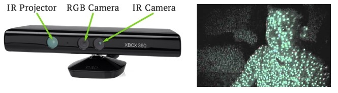
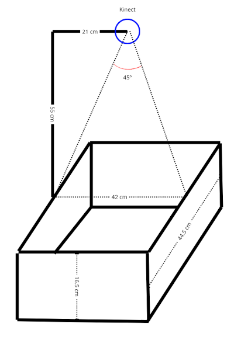
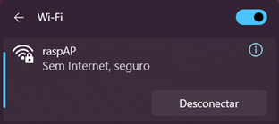
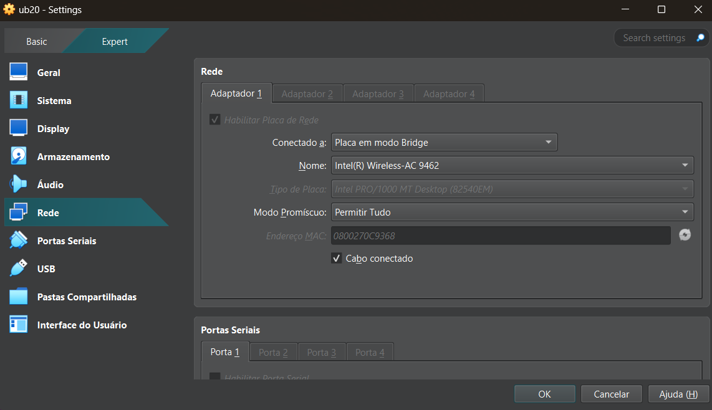
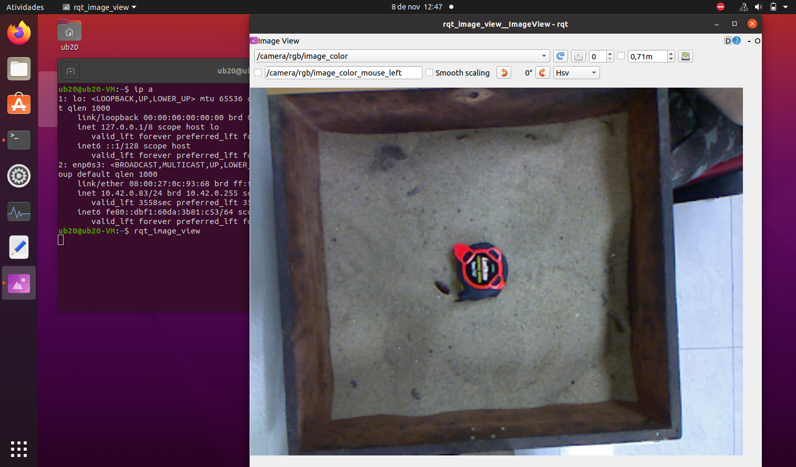
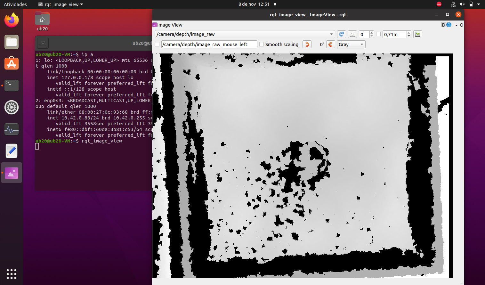
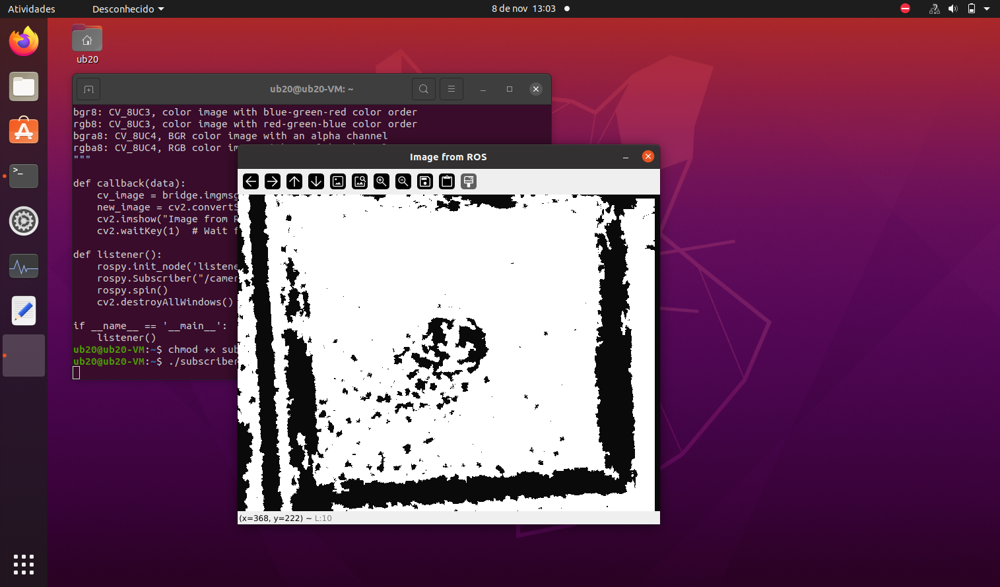

# LiDAR-experiments
Learning steps for LiDAR usage and its possibilities in conjunction with another sensors

# Kinect 360

## Summary

* [1. Kinect 360 (v1) Presentation](#section-1)
* [2. Hardware setup](#section-2)
* [3. Software setup](#section-3)
    * [3.1 Raspberry Access Point](#section-31)
    * [3.2 Install ROS on Ubuntu Xenial](#section-32)
    * [3.3 Install ROS freenect package](#section-33)
* [4. Launch ROS kinetic freenect](#section-4)
* [5. Run a ROS subscriber through Virtual Machine](#section-5)
    * [5.1 Run a subscriber](#section-51)
    * [5.2 Save data to posterior analisys](#section-52)
    * [5.3 Real time contour plot](#section-53)


## <a name="section-1"></a> 1. Kinect 360 (v1) Presentation

Kinect is one of the most popular source of PointClouds - array of points with 3D coordinates information. It has proprietary connector - actually it's USB+12V bus, and needs adapter for PC connection Despite that Kinect is bigger than ASUS Xtion, it has also tilt motor, microphone array, accelerometer and better support from ROS community.



The depth sensor is the star here. It works with a Infra-Red (IR) dot pattern emmiter in conjuntion with an IR camera sensor. The well defined baseline betwen these two sensor combined with easy homologue points recognitions make depths calculations more precise. It has heavy interference on pattern recognition with direct sunlight make it suitable for indoors only.

Some rough estimates of the accuracy of the depth sensor:

- Range: ~ 50 cm to 5 m. Can get closer (~ 40 cm) in parts, but can’t have the full view be < 50 cm.
- Horizontal Resolution: 640 x 480 and 45 degrees vertical Field of View (FOV) and 58 degrees horizontal FOV. ~ 0.75 mm per pixel at 50 cm, and ~ 3 mm per pixel at 2 m.
- Depth resolution: ~ 1.5 mm at 50 cm. About 5 cm at 5 m.
- Noise: About +-1 DN at all depths, but DN to depth is non-linear. This means +-1 mm close, and +- 5 cm far

## <a name="section-2"></a> 2. Hardware setup

The original idea is a sand box with a kinect and a projector, both aiming the sand. Kinect depths are colorized in real time and projected the plot back into the sand. Original implementation still can be found at [Augmented Reality SandBox](https://web.cs.ucdavis.edu/~okreylos/ResDev/SARndbox/). Summarized install instructions can be found at [SarndBoxExplorer](https://github.com/HumbertoDiego/SarndBoxExplorer).

The new approach differs from the original by taking more control of depths and using custom software to process data. Also, we use an announcer/subscriber method where raw depth images are sent by the announcer to subscribers wich can be different computers, a small one acting as announcer and a more robust one as a subscriber to process images.

The overall ideia is presented by below image:



The implementation resulted in:

## <a name="section-3"></a> 3. Software setup

Requirements:

* Kinect 360
* Raspiberry Pi model 3b
* Sd card with [ubuntu-mate-16.04-desktop-armhf-raspberry-pi.img](https://releases.ubuntu-mate.org/archived/16.04/armhf/) installed. (Here we set `ubuntu:ubuntu` as username and password for simplicity, you can change as you wish)
* Power supply 5V - 3A
* Internet connection plugged in via Ethernet cable (only initial steps)

### <a name="section-31"></a> 3.1 Raspberry Access Point

On Ubuntu Xenial if you want to receive an static IP address every time you connect at a certain network adapter, you will need to add at the bottom of `/etc/network/interfaces`:

```shell
sudo nano /etc/network/interfaces
    ##
    ...
    auto enxb827eb4e360a
    iface enxb827eb4e360a inet static
    address 192.168.1.20
    netmask 255.255.255.0
    gateway 192.168.1.1
    dns-nameservers 8.8.8.8 8.8.4.4
```

To use wifi to act as access point named `raspAP` with password `raspberry`:

```shell
sudo nmcli d wifi hotspot ifname wlan0 ssid raspAP password raspberry
```

The command place the raspberry as a router with IP 10.42.0.1 and also as a DHCP server assigning IPs to conected decices.

To make the access point persistent at every boot add to `etc/rc.local` but before `exit 0`:

```shell
sudo nano /etc/rc.local

    ##
    sudo nmcli d wifi hotspot ifname wlan0 ssid raspAP password raspberry

    exit 0
```

WARNING:


- Take care of always shutdown the raspberry correctly or it may restart at emergency mode on the next boot up, not rising the access point, making unavailable remote shell and forcing to plug the monitor and keyboard to troubleshot.


### <a name="section-32"></a> 3.2 Install ROS on Ubuntu Xenial

Configure your Ubuntu repositories to allow "restricted," "universe," and "multiverse." 

Setup your computer to accept software from packages.ros.org.

```shell
sudo sh -c 'echo "deb http://packages.ros.org/ros/ubuntu $(lsb_release -sc) main" > /etc/apt/sources.list.d/ros-latest.list'
```

Set up your keys

```shell
sudo apt install curl # if you haven't already installed curl
curl -s https://raw.githubusercontent.com/ros/rosdistro/master/ros.asc | sudo apt-key add -
```

ROS Installation

```shell
sudo apt-get update
sudo apt-get install ros-kinetic-desktop-full
# rosinstall and rosdep
sudo apt install python-rosdep python-rosinstall python-rosinstall-generator python-wstool build-essential
sudo rosdep init
rosdep update
# Individual Packages: (replace underscores with dashes of the package name):
sudo apt-get install ros-kinetic-PACKAGE
```

Environment setup

```shell
echo "source /opt/ros/kinetic/setup.bash" >> ~/.bashrc
source ~/.bashrc
```

### <a name="section-33"></a> 3.3 Install ROS freenect package

This [package](https://wiki.ros.org/freenect_launch) contains launch files for using a Microsoft Kinect using the [libfreenect](https://github.com/OpenKinect/libfreenect) library.

Starting from Ubuntu 11.10 (Oneiric) and Debian 7 (Wheezy), Ubuntu and Debian provide official packages of libfreenect. You can install them easily in a console:

```shell
sudo apt-get install freenect
# To start the demo applications use:
freenect-glview
```

Plug your Kinect. 3 devices must be listed with:

```shell
lsusb | grep Xbox
Bus 001 Device 021: ID 045e:02ae Microsoft Corp. Xbox NUI Camera
Bus 001 Device 019: ID 045e:02b0 Microsoft Corp. Xbox NUI Motor
Bus 001 Device 020: ID 045e:02ad Microsoft Corp. Xbox NUI Audio
```

ROS freenect package:

```shell
sudo apt install ros-kinetic-freenect-launch
sudo apt install ros-kinetic-depthimage-to-laserscan
roscore
roslaunch freenect_launch freenect.launch
rviz
```

You should see a very lag 

## <a name="section-4"></a> 4. Launch ROS kinetic freenect

Remember we have setup an access point with our Raspberry? Now it's time. Connect to it:



Your IP is somewhere `10.42.0.X`, the raspberry IP is `10.42.0.1`. On Windows, you can check using Powershell with:

```
> ipconfig /all
Adaptador de Rede sem Fio Wi-Fi:
...
   Endereço IPv4. . . . . . . .  . . . . . . . : 10.42.0.19(Preferencial)
...
   Gateway Padrão. . . . . . . . . . . . . . . : 10.42.0.1
...
```

Now your PC and Raspberry are in the same network you can SSH into it , check environment variables and launch ROS freenect:

```shell
> ssh ubuntu@10.42.0.1
ubuntu@10.42.0.1's password: 
```
```shell
ubuntu@ubuntu-desktop:~$ env | grep ROS
ROS_ROOT=/opt/ros/kinetic/share/ros
ROS_PACKAGE_PATH=/opt/ros/kinetic/share
ROS_MASTER_URI=http://localhost:11311
ROS_PYTHON_VERSION=2
ROS_VERSION=1
ROSLISP_PACKAGE_DIRECTORIES=
ROS_DISTRO=kinetic
ROS_IP=10.42.0.1
ROS_ETC_DIR=/opt/ros/kinetic/etc/ros
ubuntu@ubuntu-desktop:~$ roslaunch freenect_launch freenect.launch 
```

List all possible topics with:

```shell
ubuntu@ubuntu-desktop:~$ rostopic list
/camera/depth/camera_info
/camera/depth/disparity
/camera/depth/image
/camera/depth/image/compressed
/camera/depth/image/compressed/parameter_descriptions
/camera/depth/image/compressed/parameter_updates
/camera/depth/image/compressedDepth
/camera/depth/image/compressedDepth/parameter_descriptions
/camera/depth/image/compressedDepth/parameter_updates
/camera/depth/image/theora
/camera/depth/image/theora/parameter_descriptions
/camera/depth/image/theora/parameter_updates
/camera/depth/image_raw
/camera/depth/image_raw/compressed
/camera/depth/image_raw/compressed/parameter_descriptions
/camera/depth/image_raw/compressed/parameter_updates
/camera/depth/image_raw/compressedDepth
/camera/depth/image_raw/compressedDepth/parameter_descriptions
/camera/depth/image_raw/compressedDepth/parameter_updates
/camera/depth/image_raw/theora
/camera/depth/image_raw/theora/parameter_descriptions
/camera/depth/image_raw/theora/parameter_updates
/camera/depth/image_rect
/camera/depth/image_rect/compressed
/camera/depth/image_rect/compressed/parameter_descriptions
/camera/depth/image_rect/compressed/parameter_updates
/camera/depth/image_rect/compressedDepth
/camera/depth/image_rect/compressedDepth/parameter_descriptions
/camera/depth/image_rect/compressedDepth/parameter_updates
/camera/depth/image_rect/theora
/camera/depth/image_rect/theora/parameter_descriptions
/camera/depth/image_rect/theora/parameter_updates
/camera/depth/image_rect_raw
/camera/depth/image_rect_raw/compressed
/camera/depth/image_rect_raw/compressed/parameter_descriptions
/camera/depth/image_rect_raw/compressed/parameter_updates
/camera/depth/image_rect_raw/compressedDepth
/camera/depth/image_rect_raw/compressedDepth/parameter_descriptions
/camera/depth/image_rect_raw/compressedDepth/parameter_updates
/camera/depth/image_rect_raw/theora
/camera/depth/image_rect_raw/theora/parameter_descriptions
/camera/depth/image_rect_raw/theora/parameter_updates
/camera/depth/points
/camera/depth_rectify_depth/parameter_descriptions
/camera/depth_rectify_depth/parameter_updates
/camera/depth_registered/camera_info
/camera/depth_registered/disparity
/camera/depth_registered/hw_registered/image_rect
/camera/depth_registered/hw_registered/image_rect/compressed
/camera/depth_registered/hw_registered/image_rect/compressed/parameter_descriptions
/camera/depth_registered/hw_registered/image_rect/compressed/parameter_updates
/camera/depth_registered/hw_registered/image_rect/compressedDepth
/camera/depth_registered/hw_registered/image_rect/compressedDepth/parameter_descriptions
/camera/depth_registered/hw_registered/image_rect/compressedDepth/parameter_updates
/camera/depth_registered/hw_registered/image_rect/theora
/camera/depth_registered/hw_registered/image_rect/theora/parameter_descriptions
/camera/depth_registered/hw_registered/image_rect/theora/parameter_updates
/camera/depth_registered/hw_registered/image_rect_raw
/camera/depth_registered/hw_registered/image_rect_raw/compressed
/camera/depth_registered/hw_registered/image_rect_raw/compressed/parameter_descriptions
/camera/depth_registered/hw_registered/image_rect_raw/compressed/parameter_updates
/camera/depth_registered/hw_registered/image_rect_raw/compressedDepth
/camera/depth_registered/hw_registered/image_rect_raw/compressedDepth/parameter_descriptions
/camera/depth_registered/hw_registered/image_rect_raw/compressedDepth/parameter_updates
/camera/depth_registered/hw_registered/image_rect_raw/theora
/camera/depth_registered/hw_registered/image_rect_raw/theora/parameter_descriptions
/camera/depth_registered/hw_registered/image_rect_raw/theora/parameter_updates
/camera/depth_registered/image
/camera/depth_registered/image/compressed
/camera/depth_registered/image/compressed/parameter_descriptions
/camera/depth_registered/image/compressed/parameter_updates
/camera/depth_registered/image/compressedDepth
/camera/depth_registered/image/compressedDepth/parameter_descriptions
/camera/depth_registered/image/compressedDepth/parameter_updates
/camera/depth_registered/image/theora
/camera/depth_registered/image/theora/parameter_descriptions
/camera/depth_registered/image/theora/parameter_updates
/camera/depth_registered/image_raw
/camera/depth_registered/image_raw/compressed
/camera/depth_registered/image_raw/compressed/parameter_descriptions
/camera/depth_registered/image_raw/compressed/parameter_updates
/camera/depth_registered/image_raw/compressedDepth
/camera/depth_registered/image_raw/compressedDepth/parameter_descriptions
/camera/depth_registered/image_raw/compressedDepth/parameter_updates
/camera/depth_registered/image_raw/theora
/camera/depth_registered/image_raw/theora/parameter_descriptions
/camera/depth_registered/image_raw/theora/parameter_updates
/camera/depth_registered/points
/camera/depth_registered/sw_registered/camera_info
/camera/depth_registered/sw_registered/image_rect
/camera/depth_registered/sw_registered/image_rect/compressed
/camera/depth_registered/sw_registered/image_rect/compressed/parameter_descriptions
/camera/depth_registered/sw_registered/image_rect/compressed/parameter_updates
/camera/depth_registered/sw_registered/image_rect/compressedDepth
/camera/depth_registered/sw_registered/image_rect/compressedDepth/parameter_descriptions
/camera/depth_registered/sw_registered/image_rect/compressedDepth/parameter_updates
/camera/depth_registered/sw_registered/image_rect/theora
/camera/depth_registered/sw_registered/image_rect/theora/parameter_descriptions
/camera/depth_registered/sw_registered/image_rect/theora/parameter_updates
/camera/depth_registered/sw_registered/image_rect_raw
/camera/depth_registered/sw_registered/image_rect_raw/compressed
/camera/depth_registered/sw_registered/image_rect_raw/compressed/parameter_descriptions
/camera/depth_registered/sw_registered/image_rect_raw/compressed/parameter_updates
/camera/depth_registered/sw_registered/image_rect_raw/compressedDepth
/camera/depth_registered/sw_registered/image_rect_raw/compressedDepth/parameter_descriptions
/camera/depth_registered/sw_registered/image_rect_raw/compressedDepth/parameter_updates
/camera/depth_registered/sw_registered/image_rect_raw/theora
/camera/depth_registered/sw_registered/image_rect_raw/theora/parameter_descriptions
/camera/depth_registered/sw_registered/image_rect_raw/theora/parameter_updates
/camera/depth_registered_rectify_depth/parameter_descriptions
/camera/depth_registered_rectify_depth/parameter_updates
/camera/driver/parameter_descriptions
/camera/driver/parameter_updates
/camera/ir/camera_info
/camera/ir/image_raw
/camera/ir/image_raw/compressed
/camera/ir/image_raw/compressed/parameter_descriptions
/camera/ir/image_raw/compressed/parameter_updates
/camera/ir/image_raw/compressedDepth
/camera/ir/image_raw/compressedDepth/parameter_descriptions
/camera/ir/image_raw/compressedDepth/parameter_updates
/camera/ir/image_raw/theora
/camera/ir/image_raw/theora/parameter_descriptions
/camera/ir/image_raw/theora/parameter_updates
/camera/ir/image_rect_ir
/camera/ir/image_rect_ir/compressed
/camera/ir/image_rect_ir/compressed/parameter_descriptions
/camera/ir/image_rect_ir/compressed/parameter_updates
/camera/ir/image_rect_ir/compressedDepth
/camera/ir/image_rect_ir/compressedDepth/parameter_descriptions
/camera/ir/image_rect_ir/compressedDepth/parameter_updates
/camera/ir/image_rect_ir/theora
/camera/ir/image_rect_ir/theora/parameter_descriptions
/camera/ir/image_rect_ir/theora/parameter_updates
/camera/ir_rectify_ir/parameter_descriptions
/camera/ir_rectify_ir/parameter_updates
/camera/projector/camera_info
/camera/rgb/camera_info
/camera/rgb/image_color
/camera/rgb/image_color/compressed
/camera/rgb/image_color/compressed/parameter_descriptions
/camera/rgb/image_color/compressed/parameter_updates
/camera/rgb/image_color/compressedDepth
/camera/rgb/image_color/compressedDepth/parameter_descriptions
/camera/rgb/image_color/compressedDepth/parameter_updates
/camera/rgb/image_color/theora
/camera/rgb/image_color/theora/parameter_descriptions
/camera/rgb/image_color/theora/parameter_updates
/camera/rgb/image_mono
/camera/rgb/image_mono/compressed
/camera/rgb/image_mono/compressed/parameter_descriptions
/camera/rgb/image_mono/compressed/parameter_updates
/camera/rgb/image_mono/compressedDepth
/camera/rgb/image_mono/compressedDepth/parameter_descriptions
/camera/rgb/image_mono/compressedDepth/parameter_updates
/camera/rgb/image_mono/theora
/camera/rgb/image_mono/theora/parameter_descriptions
/camera/rgb/image_mono/theora/parameter_updates
/camera/rgb/image_raw
/camera/rgb/image_raw/compressed
/camera/rgb/image_raw/compressed/parameter_descriptions
/camera/rgb/image_raw/compressed/parameter_updates
/camera/rgb/image_raw/compressedDepth
/camera/rgb/image_raw/compressedDepth/parameter_descriptions
/camera/rgb/image_raw/compressedDepth/parameter_updates
/camera/rgb/image_raw/theora
/camera/rgb/image_raw/theora/parameter_descriptions
/camera/rgb/image_raw/theora/parameter_updates
/camera/rgb/image_rect_color
/camera/rgb/image_rect_color/compressed
/camera/rgb/image_rect_color/compressed/parameter_descriptions
/camera/rgb/image_rect_color/compressed/parameter_updates
/camera/rgb/image_rect_color/compressedDepth
/camera/rgb/image_rect_color/compressedDepth/parameter_descriptions
/camera/rgb/image_rect_color/compressedDepth/parameter_updates
/camera/rgb/image_rect_color/theora
/camera/rgb/image_rect_color/theora/parameter_descriptions
/camera/rgb/image_rect_color/theora/parameter_updates
/camera/rgb/image_rect_mono
/camera/rgb/image_rect_mono/compressed
/camera/rgb/image_rect_mono/compressed/parameter_descriptions
/camera/rgb/image_rect_mono/compressed/parameter_updates
/camera/rgb/image_rect_mono/compressedDepth
/camera/rgb/image_rect_mono/compressedDepth/parameter_descriptions
/camera/rgb/image_rect_mono/compressedDepth/parameter_updates
/camera/rgb/image_rect_mono/theora
/camera/rgb/image_rect_mono/theora/parameter_descriptions
/camera/rgb/image_rect_mono/theora/parameter_updates
/camera/rgb_debayer/parameter_descriptions
/camera/rgb_debayer/parameter_updates
/camera/rgb_rectify_color/parameter_descriptions
/camera/rgb_rectify_color/parameter_updates
/camera/rgb_rectify_mono/parameter_descriptions
/camera/rgb_rectify_mono/parameter_updates
/diagnostics
/rosout
/rosout_agg
/tf
/tf_static
```

We will subscribe to these topics later: `/camera/rgb/image_color` and `/camera/depth/image_raw`.

## <a name="section-5"></a> 5. Run ROS subscriber through Virtual Machine

An easy way to install updated version of ROS that listen to our announcer is by a virtual machine. Install Virtual Box. Get an [Ubuntu](https://ubuntu.com/download/desktop) image. Then install ROS Noetic on it.

```shell
ub20@ub20-VM:~$ sudo wget -c https://raw.githubusercontent.com/qboticslabs/ros_install_noetic/master/ros_install_noetic.sh && chmod +x ./ros_install_noetic.sh && ./ros_install_noetic.sh
```

Correct the environment variables of our VM:

```shell
ub20@ub20-VM:~$ echo "export ROS_IP=10.42.0.1" >> ~/.bashrc
ub20@ub20-VM:~$ echo "export ROS_MASTER_URI=http://10.42.0.1:11311" >> ~/.bashrc
ub20@ub20-VM:~$ source ~/.bashrc
ub20@ub20-VM:~$ env | grep ROS
ROS_VERSION=1
ROS_PYTHON_VERSION=3
ROS_PACKAGE_PATH=/home/ub20/ldlidar_ros_ws/src:/opt/ros/noetic/share
ROSLISP_PACKAGE_DIRECTORIES=/home/ub20/ldlidar_ros_ws/devel/share/common-lisp
ROS_IP=10.42.0.1
ROS_ETC_DIR=/opt/ros/noetic/etc/ros
ROS_MASTER_URI=http://10.42.0.1:11311
ROS_ROOT=/opt/ros/noetic/share/ros
ROS_DISTRO=noetic
```

Set bridge mode on the WIFI network adapter from host to VM, so it will act as another computer on the `RaspAP` network:



Going back to your VM, check if the IP is somewhere `10.42.0.X`, and ping Raspberry to check if it is reachable:

```shell
ub20@ub20-VM:~$ ip a | grep inet
...
    inet 10.42.0.83/24 brd 10.42.0.255 scope global dynamic noprefixroute enp0s3

ub20@ub20-VM:~$ ping 10.42.0.1
PING 10.42.0.1 (10.42.0.1) 56(84) bytes of data.
64 bytes de 10.42.0.1: icmp_seq=1 ttl=64 tempo=21.6 ms
64 bytes de 10.42.0.1: icmp_seq=2 ttl=64 tempo=10.9 ms
...
```

Now we are good to go, 1st check the Raspberry data transmission and vizualize some raw data:

```shell
ub20@ub20-VM:~$ rostopic list
# should return all topics
ub20@ub20-VM:~$ rostopic echo /camera/depth/image_raw
...
 [178, 63, 134, 235, 177, 63, 134, 235, 177, 63, 33, 176, 178, 63, 134, 235, 177, 63, 33, 176, 178, 63, 189, 116, 179, 63, 148, 24, 180, 63, 48, 221, 180, 63, 48, 221, 180, 63, 148, 24, 180, 63, 148, 24, 180, 63, 148, 24, 180, 63, 148, 24, 180, 63, 148, 24, 180, 63, 148, 24, 180, 63, 148, 24, 180, 63, 48, 221, 180, 63, 48, 221, 180, 63, 203, 161, 181, 63, 0, 0, 192, 127, 0, 0, 192, 127, 0, 0, 192, 127, 0, 0, 192, 127, 0, 0, 192, 127, 0, 0, 192, 127, 0, 0, 192, 127, 0, 0, 192, 127
---
```

Press Ctrl+c to stop the message.

2nd vizualize some data:

```sehll
ub20@ub20-VM:~$ rqt_image_view
```





## <a name="section-51"></a> 5.1 Run a subscriber

The depth topic send Image data type messages that has this structure (you can experiment check the [authors page](https://wiki.ros.org/freenect_camera?distro=melodic) for more details):

```
sensor_msgs/Image.msg:
# This message contains an uncompressed image
# (0, 0) is at top-left corner of image
#
Header header        # Header timestamp should be acquisition time of image
                     # Header frame_id should be optical frame of camera
                     # origin of frame should be optical center of camera
                     # +x should point to the right in the image
                     # +y should point down in the image
                     # +z should point into to plane of the image
                     # If the frame_id here and the frame_id of the CameraInfo
                     # message associated with the image conflict
                     # the behavior is undefined

uint32 height         # image height, that is, number of rows
uint32 width          # image width, that is, number of columns

# The legal values for encoding are in file src/image_encodings.cpp
# If you want to standardize a new string format, join
# ros-users@lists.sourceforge.net and send an email proposing a new encoding.

string encoding       # Encoding of pixels -- channel meaning, ordering, size
                      # taken from the list of strings in include/sensor_msgs/image_encodings.h

uint8 is_bigendian    # is this data bigendian?
uint32 step           # Full row length in bytes
uint8[] data          # actual matrix data, size is (step * rows)
```

To convert the data vector into an actual matrix would be painfull, but OpenCV already has a nice implementaiton of it, so we can got to our last step:

3rd run a subscriber to change data on the fly:

```python
#!/usr/bin/python3
import cv2
import rospy
from sensor_msgs.msg import Image
from cv_bridge import CvBridge
bridge = CvBridge()

def callback(data):
    cv_image = bridge.imgmsg_to_cv2(data, desired_encoding='passthrough')
    new_image = cv2.convertScaleAbs(cv_image, alpha=1, beta=10)
    cv2.imshow("Image from ROS", new_image)
    cv2.waitKey(1)  # Wait for a key press to update the image

def listener():
    rospy.init_node('listener', anonymous=True)
    rospy.Subscriber("/camera/depth/image_raw" , Image, callback)
    rospy.spin()
    cv2.destroyAllWindows()

if __name__ == '__main__':
    listener()
```

Save it as `subscriber.py` give permissions and run it:

```shell
ub20@ub20-VM:~$ chmod +x subscriber.py
ub20@ub20-VM:~$ ./subscriber.py
```



## <a name="section-52"></a> 5.2 Save data to posterior analisys

A simple subscriber can do this job:

```python
#!/usr/bin/python3
import cv2
import rospy
from sensor_msgs.msg import Image
from cv_bridge import CvBridge
bridge = CvBridge()
import numpy as np

frame = 0
def callback(data):
    global frame
    cv_image = bridge.imgmsg_to_cv2(data, desired_encoding='passthrough')
    filename = "depth_{frame:02d}.npy"
    np.savetxt(filename, cv_image)
    frame += 1
    print(f"Saved {filename}")

def listener():
    rospy.init_node('listener', anonymous=True)
    rospy.Subscriber("/camera/depth/image_raw" , Image, callback)
    rospy.spin()
    cv2.destroyAllWindows()

if __name__ == '__main__':
    listener()
```

Save calibration data if needed to use as kinect setup parameters, example:

```shell
# image crop rectangle: x1,y1 and x2,y2 
ub20@ub20-VM:~$ echo "118, 12, 550, 408" > calib.txt 
```

A subscriber to show cropped data in real time:

```Python
#!/usr/bin/python3
import cv2
import rospy
import numpy as np
from sensor_msgs.msg import Image
from cv_bridge import CvBridge, CvBridgeError

bridge = CvBridge()
inner_box = list(map(int, open("calib.txt").read().split(",")))

def callback(image_msg):
    global inner_box
    # Converte a imagem de profundidade para um formato OpenCV (como array NumPy)
    depth_image = bridge.imgmsg_to_cv2( image_msg, desired_encoding="passthrough")
    # Corta dentro da areia
    depth_image_cropped = depth_image[inner_box[0]:inner_box[2],
                                      inner_box[1]:inner_box[3]]

    depth_image_cropped = np.where(depth_image_cropped == 0, np.nan, depth_image_cropped)
    
    cv2.imshow("depth",depth_image_cropped)

    if cv2.waitKey(0) & 0xFF == ord('q'):
        rospy.signal_shutdown("Closing...")

def listener():
    rospy.init_node('listener', anonymous=True)
    rospy.Subscriber("/camera/depth/image_raw", Image, callback)
    rospy.spin()
    cv2.destroyAllWindows()

if __name__ == '__main__':
    listener()
```

## <a name="section-53"></a> 5.3 Real time contour plot

<!-- 
git init
git remote add origin https://github.com/HumbertoDiego/lidar-experiments
git pull origin main
#Do changes
git add * ; git commit -m "update Kinect files"; git push -u origin main
 -->
