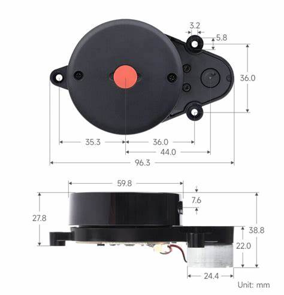
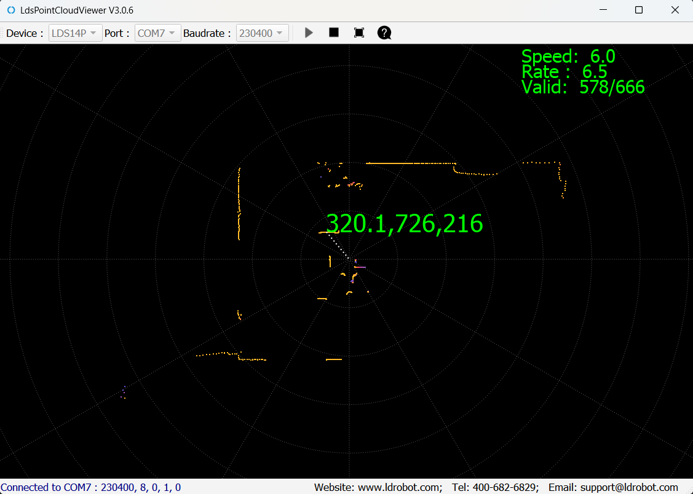

# LiDAR-experiments
Learning steps for LiDAR usage and its possibilities in conjunction with another sensors

## Summary

* [1. Lidar 360º - LD14P Presentation](#section-1)
* [2. Installation in a Raspberry and run the ROS publisher via USB](#section-2)
* [3. Installation in another platforms](#section-3)
    * [Install on a Raspberry via GPIO](#section-31)
    * [Install on a Ubuntu/MacOS computer via USB](#section-32)
    * [Install on a Windows 11 computer via USB](#section-33)
        *  [Direct on Windows 11](#section-331)
        *  [Use a WSL Ubuntu 20.04 distro as middle layer](#section-332)
* [4. Get data with a ROS subscriber](#section-4)
* [5. Using ROS Rviz for visualization](#section-5)
* [6. Combining with inertial sensor](#section-6)


## <a name="section-1"></a> 1. Lidar 360º - LD14P Presentation



There are a lot of 360° LIDAR out there, RoboPeak Team started make low cost ones and get its name popularized in some models like RP Lidar A1 series from SLAMTEC. In general, you will have to follow the manufacturer instructions to have it running. Some times, some instructions are the same for different 360° LiDARs. 

We will be using here the **LD14P** from [ShenZhen LDROBOT Co., LTD , Sensor team](https://github.com/ldrobotSensorTeam), that claims it's a short distance 360º LiDAR, whith 2-8Hz(default 6Hz), minimum measure distance of 0.1m, range of 6-8m dependig on if its black or white, support for ROS1, ROS2, Python routines that run on Ubuntu and Windows.

## <a name="section-2"></a> 2. Installation in a Raspberry and run the ROS publisher via USB

The initial setup is on top of a [Raspberry Pi 3B](https://www.raspberrypi.com/products/) motherboard. It's main purpose is to use ROS publish system to send data to remote subscribers, but we will to this at steps, in a first momment it will also acts as a subscriber, later we will install and run a remote subscriber.


Requirements:

* LD14P 360º LiDAR
* Serial port to USB adapter board
* Raspiberry Pi model 3b
* Sd card with [2023-02-09-ubiquity-base-focal-raspberry-pi.img](https://learn.ubiquityrobotics.com/noetic_pi_image_downloads) installed
* Power supply 5V - 3A
* Internet connection plugged in via Ethernet cable (only initial steps)

Burn the image in the SD card and plug it on the Pi, plug the LiDAR and the adapter with the serial cable. The adapter and Raspberry with the USB cable and Raspbeery to power with ther power supply. We don't need a monitor or keyboard, simple as that. The internet coonection from ethernet port will be of great help in initial steps to install other dependencies on the Pi.

### SSH connection to Raspberry pi

With this Ubiquity image, the wifi adapter of the Raspberry Pi acts as an Access Point, so we just need to enter `ubiquityrobotXXXX` network, where XXXX is part of the MAC address. The password is `robotseverywhere`. The sudo username is `ubuntu` with password `ubuntu`. 

In this network, just run on a shell:

```shell
ssh ubuntu@10.42.0.1
```

Enter the `ubuntu` password to get inside the Raspberry shell. Now, we can check all IP addresses with:

```shell
ubuntu@ubiquityrobot:~$ ip a | grep "inet "
    inet 127.0.0.1/8 scope host lo
    inet 192.168.1.20/24 brd 192.168.1.255 scope global enxb827ebe94c24
    inet 10.42.0.1/24 brd 10.42.0.255 scope global noprefixroute wlan0
```

Now you can disconnect from `ubiquityrobotXXXX` network, connect back to your own router network to continue accessing internet and SSH again with this other IP received by Raspberry from your router, in this case:

```shell
ssh ubuntu@192.168.1.20
```

It's a good practice to force the same IP received by the Pi. Just create a file like this one below, change the name of the network adapter, DNS and gateway to match your network. 

```shell
ubuntu@ubiquityrobot:~$ cat /etc/netplan/01-netcfg.yaml 
network:
    version: 2
    renderer: networkd
    ethernets:
        enxb827ebe94c24:
            dhcp4: no
            addresses:
                - 192.168.1.20/24
            gateway4: 192.168.1.1
            nameservers:
                addresses: [8.8.8.8,1.1.1.1]
```

If you know that the LiDAR will be used allways in the same wifi network, you could just connect to it at start up. Change the network adapter name in the file above and run `ubuntu@ubiquityrobot:~$ sudo pifi add <NETWORK-SSID> <NETWORK-PASSWD>`.

### Check LiDAR USB port

Plug and unplug the LiDAR from USB port to check if the device is been recognized. In general, when plugged it starts spinning.

```shell
ubuntu@ubiquityrobot:~$ lsusb
Bus 001 Device 005: ID 1a86:55d4 QinHeng Electronics 
...
```

We also need to know the device full path name. For this, generate a file with the list of devices before and after pluggin the LiDAR. 

```shell
# Unplug Device
ubuntu@ubiquityrobot:~$ ls /dev > nolidar
# Plug Device
ubuntu@ubiquityrobot:~$ ls /dev > withlidar
# Check the differences
ubuntu@ubiquityrobot:~$ diff withlidar nolidar 
69d68
< serial
140d138
< ttyACM0
```

So, in this case, the device full path is `/dev/ttyACM0`.

### Install manufacturers drivers

Another good thing about this Ubiquity image is that it already comes with ROS Noetic pre installed. Ros is a publisher/subscriber system to enable communication with various manufacturers devices.

```shell
ubuntu@ubiquityrobot:~$ 
cd ~ && mkdir -p ldlidar_ros_ws/src

cd ldlidar_ros_ws/src && git clone  https://github.com/ldrobotSensorTeam/ldlidar_sl_ros.git

sudo chmod 777 /dev/ttyACM0

cd ~/ldlidar_ros_ws && sed -i 's/ttyUSB0/ttyACM0/' src/ldlidar_sl_ros/launch/ld14p.launch 

cd ~/ldlidar_ros_ws && rosdep install --from-paths src --ignore-src -r -y

cd ~/ldlidar_ros_ws && catkin_make

cd ~/ldlidar_ros_ws && source devel/setup.bash

echo "source ~/ldlidar_ros_ws/devel/setup.bash" >> ~/.bashrc
```

From now on you can run the publisher just by:

```shell
ubuntu@ubiquityrobot:~$ roslaunch ldlidar_sl_ros ld14p.launch
... logging to /home/ubuntu/.ros/log/c0943ed8-7154-11ef-a454-b827ebe94c24/roslaunch-ubiquityrobot-1118.log
Checking log directory for disk usage. This may take a while.
Press Ctrl-C to interrupt
Done checking log file disk usage. Usage is <1GB.

started roslaunch server http://ubiquityrobot.local:42485/

SUMMARY
========

PARAMETERS
 * /ldlidar_publisher_ld14/angle_crop_max: 225.0
 * /ldlidar_publisher_ld14/angle_crop_min: 135.0
 * /ldlidar_publisher_ld14/enable_angle_crop_func: False
 * /ldlidar_publisher_ld14/frame_id: base_laser
 * /ldlidar_publisher_ld14/laser_scan_dir: True
 * /ldlidar_publisher_ld14/laser_scan_topic_name: scan
 * /ldlidar_publisher_ld14/point_cloud_2d_topic_name: pointcloud2d
 * /ldlidar_publisher_ld14/port_name: /dev/ttyACM0
 * /ldlidar_publisher_ld14/product_name: LDLiDAR_LD14P
 * /ldlidar_publisher_ld14/serial_baudrate: 230400
 * /rosdistro: noetic
 * /rosversion: 1.15.15

NODES
  /
    base_to_laserLD14 (tf/static_transform_publisher)
    ldlidar_publisher_ld14 (ldlidar_sl_ros/ldlidar_sl_ros_node)

ROS_MASTER_URI=http://ubiquityrobot:11311

process[ldlidar_publisher_ld14-1]: started with pid [1133]
process[base_to_laserLD14-2]: started with pid [1139]
[ INFO] [1726181935.777882190]: LDLiDAR SDK Pack Version is:3.0.5
[ INFO] [1726181935.785446947]: ROS param input:
[ INFO] [1726181935.785777883]: <product_name>: LDLiDAR_LD14P
[ INFO] [1726181935.785948560]: <laser_scan_topic_name>: scan
[ INFO] [1726181935.786070330]: <point_cloud_2d_topic_name>: pointcloud2d
[ INFO] [1726181935.786213090]: <frame_id>: base_laser
[ INFO] [1726181935.786383454]: <port_name>: /dev/ttyACM0
[ INFO] [1726181935.786561109]: <serial_baudrate>: 230400
[ INFO] [1726181935.786703556]: <laser_scan_dir>: Counterclockwise
[ INFO] [1726181935.786872878]: <enable_angle_crop_func>: false
[ INFO] [1726181935.787040378]: <angle_crop_min>: 135.000000
[ INFO] [1726181935.787196262]: <angle_crop_max>: 225.000000
[LDS][INFO][1726181935.788788807][Actual BaudRate reported:230400]
[ INFO] [1726181935.789439846]: ldlidar driver start is success
[ INFO] [1726181935.797392987]: ldlidar communication is normal.
[ INFO] [1726181935.814503065]: start normal, pub lidar data
```

As we can see, there are two nodes runnig, `/ldlidar_publisher_ld14` and `/base_to_laserLD14` . Check them with: 

```shell
ubuntu@ubiquityrobot:~$ rosnode info /ldlidar_publisher_ld14
Node [/ldlidar_publisher_ld14]
Publications:
 * /pointcloud2d [sensor_msgs/PointCloud]
 * /rosout [rosgraph_msgs/Log]
 * /scan [sensor_msgs/LaserScan]
 ...

ubuntu@ubiquityrobot:~$ rosnode info /base_to_laserLD14
Node [/base_to_laserLD14]
Publications:
 * /rosout [rosgraph_msgs/Log]
 * /tf [tf2_msgs/TFMessage]
 ...
```

You can check the message structure of each topic by:

```shell
ubuntu@ubiquityrobot:~$ rosmsg show sensor_msgs/PointCloud
std_msgs/Header header
  uint32 seq
  time stamp
  string frame_id
geometry_msgs/Point32[] points
  float32 x
  float32 y
  float32 z
sensor_msgs/ChannelFloat32[] channels
  string name
  float32[] values

ubuntu@ubiquityrobot:~$ rosmsg show sensor_msgs/LaserScan
std_msgs/Header header
  uint32 seq
  time stamp
  string frame_id
float32 angle_min
float32 angle_max
float32 angle_increment
float32 time_increment
float32 scan_time
float32 range_min
float32 range_max
float32[] ranges
float32[] intensities
```

As we can see, we can either get (x,y,z) of a returned laser shot point if we subscribe to `/pointcloud2d` topic or ranges whith angle increment if we subscribe to `/scan` topic.

Let's check `pointcloud2d` and `scan` topics:

```shell
ubuntu@ubiquityrobot:~$ rostopic echo /pointcloud2d
header:
  seq: 9575
  stamp:
    secs: 1726193242
    nsecs: 184712366
  frame_id: "base_laser"
points:
  -
    x: -2.5465500354766846
    y: 2.3231210708618164
    z: 0.0
...
  -
    x: 2.8701744079589844
    y: 0.3379339873790741
    z: 0.0
channels:
  -
    name: "intensity"
    values: [214.0, ..., 214.0]
  -
    name: "timeincrement"
    values: [0.00025099029880948365]
  -
    name: "scantime"
    values: [0.16665756702423096]
...

ubuntu@ubiquityrobot:~$ rostopic echo /scan
header: 
  seq: 4599
  stamp:
    secs: 1726192410
    nsecs: 684359223
  frame_id: "base_laser"
angle_min: 0.0
angle_max: 6.2831854820251465
angle_increment: 0.009420068003237247
time_increment: 0.0002497385139577091
scan_time: 0.1665755808353424
range_min: 0.019999999552965164
range_max: 12.0
ranges: [3.0339999198913574, ..., 3.066999912261963]
intensities: [214.0, ..., 212.0]
...
```

Press Ctrl+c to stop the messages. 

## <a name="section-3"></a> 3. Installation in another platforms

### <a name="section-31"></a> Install on a Raspberry via GPIO

### <a name="section-32"></a> Install on a Ubuntu/MacOS computer via USB

### <a name="section-33"></a> Install on a Windows 11 computer via USB

#### <a name="section-331"> Direct on Windows 11

Requirements
 * When under Windows, it is necessary to install the serial port driver of the USB adapter board. The apdapter name is CP2102 and its driver can be obtained from Silicon Labs' official website:  [CP210x_Universal_Windows_Driver](https://www.silabs.com/developers/usb-to-uart-bridge-vcp-drivers). Don't worry if you don't find it there, there is another copy [here](https://github.com/HumbertoDiego/lidar-experiments/tree/main/manuals) and [here](https://github.com/ldrobotSensorTeam/ld_desktop_tool/releases/tag/V2.3.13) or just run Windows Update to find the driver. However, there is no SDK for Windows 7 and on, MacOS or Linux. 
 * They offer a visualization tool called [LdsPointCloudViewer-v3.0.6](https://github.com/ldrobotSensorTeam/ld_desktop_tool/releases).

Install both, connect the LiDAR to you PC USB port, open the LdsPointCloudViewer software, choose Device: LDS14P, Port and hit play. The result is shown below:



#### <a name="section-332"> Use a WSL Ubuntu 20.04 distro as middle layer

Requirements
* Fazer o download e instalar o [Windows Subsystem for Linux Kernel](https://wslstorestorage.blob.core.windows.net/wslblob/wsl_update_x64.msi "Windows Subsystem for Linux Kernel") (wsl2kernel)
* [usbipd-win](https://github.com/dorssel/usbipd-win/releases) to share USB devices connected to Windows to the WSL.

Open Windows 11 terminal as administrator and type this to check available distros:

```shell
> wsl --list --online
A seguir está uma lista de distribuições válidas que podem ser instaladas.
Instale usando "wsl --install -d <Distro>".

NAME                            FRIENDLY NAME
Ubuntu                          Ubuntu
Debian                          Debian GNU/Linux
kali-linux                      Kali Linux Rolling
Ubuntu-18.04                    Ubuntu 18.04 LTS
Ubuntu-20.04                    Ubuntu 20.04 LTS
Ubuntu-22.04                    Ubuntu 22.04 LTS
Ubuntu-24.04                    Ubuntu 24.04 LTS
OracleLinux_7_9                 Oracle Linux 7.9
OracleLinux_8_7                 Oracle Linux 8.7
OracleLinux_9_1                 Oracle Linux 9.1
openSUSE-Leap-15.6              openSUSE Leap 15.6
SUSE-Linux-Enterprise-15-SP5    SUSE Linux Enterprise 15 SP5
SUSE-Linux-Enterprise-15-SP6    SUSE Linux Enterprise 15 SP6
openSUSE-Tumbleweed             openSUSE Tumbleweed
```

Install Ubuntu 20.04

```shell
> wsl --install -d Ubuntu-20.04
Instalando: Ubuntu 20.04 LTS
Ubuntu 20.04 LTS foi instalado.
Lançando Ubuntu 20.04 LTS...
```

Open Ubuntu terminal and install ROS Noetic with the [single line command](https://wiki.ros.org/ROS/Installation/TwoLineInstall/).

```shell
user@ub20:~$ wget -c https://raw.githubusercontent.com/qboticslabs/ros_install_noetic/master/ros_install_noetic.sh && chmod +x ./ros_install_noetic.sh && ./ros_install_noetic.sh
...
```

Also, install other dependencies on Ubuntu:

```shell
user@ub20:~$ sudo apt install linux-tools-5.4.0-77-generic hwdata
...
user@ub20:~$ sudo update-alternatives --install /usr/local/bin/usbip usbip /usr/lib/linux-tools/5.4.0-77-generic/usbip 20
...
```

From an administrator command prompt on Windows, run this command. It will list all the USB devices connected to Windows.

```shell
# Unplug Device
> usbipd list
Connected:
BUSID  VID:PID    DEVICE                              STATE
2-2    275d:0ba6  Dispositivo de Entrada USB          Not shared
2-10   8087:0aaa  Intel(R) Wireless Bluetooth(R)      Not shared
# Plug Device
> usbipd list
Connected:
BUSID  VID:PID    DEVICE                              STATE
2-1    1a86:55d4  USB-Enhanced-SERIAL CH9102 (COM7)   Not shared
2-2    275d:0ba6  Dispositivo de Entrada USB          Not shared
2-10   8087:0aaa  Intel(R) Wireless Bluetooth(R)      Not shared
```

Select the bus ID of the device you’d like to attach to WSL and run this command. In our case, with busid `2-1`. 

```shell
# Share Device
> usbipd bind --busid 2-1
# Attach Device
> usbipd attach --wsl --busid 2-1
usbipd: info: Using WSL distribution 'Ubuntu-20.04' to attach; the device will be available in all WSL 2 distributions.
usbipd: info: Using IP address 172.26.0.1 to reach the host.
```

If you unplug device, repeat the last command above. Now go back to Ubuntu 20.04 terminal and check the new device with `ls /dev`. In our case, again `/dev/ttyACM0` showed up. You can use the same commands used on [Raspberry Pi Ubiquity installation of manufacturers drivers](#install-manufacturers-drivers) now. 

From now on you can run the publisher inside Ubuntu shell just by:

```shell
user@ub20:~$ roslaunch ldlidar_sl_ros ld14p.launch
```

Also, we can setup up a GUI forwarding to allow us to access from Windows, the ROS Rviz visualization tool executed inside Ubuntu. Follow this guide [here](https://jackkawell.wordpress.com/2020/06/12/ros-wsl2/) to get details. 

<!-- First, install and run [VcXsrv Windows X Server](https://sourceforge.net/projects/vcxsrv/), you will VcXsrv icon down in your icon tray.

On your Windows terminal get the IP address that WSL sees Windows:

```shell
> ipconfig
...
Adaptador Ethernet vEthernet (WSL):
...
   Endereço IPv4. . . . . . . .  . . . . . . . : 172.26.0.1
...
```

Go back to Ubuntu terminal and set DISPLAY environment variable which tells WSL2 where to send the graphics for any application that needs a display to function. Change the IP address (`172.26.0.1`) to fit your case.

```shell
user@ub20:~$ echo 'export DISPLAY=172.26.0.1:0.0' >> ~/.bashrc
```

From now on you can run the publisher inside Ubuntu shell and launch Rviz just by:

```shell
user@ub20:~$ roslaunch ldlidar_sl_ros viewer_ld14p_noetic.launch
```
-->

## <a name="section-4"></a> 4. Get data with a ROS subscriber

Here, we aim to write a program to return a csv (`timestamp,x,y,z`) of some time of the LiDAR operation.

```Python
#!/usr/bin/python3
import rospy
from sensor_msgs.msg import PointCloud

def add_increment_to_timestamp(timestamp, increment, size):
    return [timestamp+i*increment for i in range(size)]

def put_together(timestamps, points):
    return f"{timestamps},{points.x},{points.y},{points.z}\n"

def callback(data):
    # Get x,y,z
    points = data.points
    # Get timestamps
    initial_timestamp = data.header.stamp.secs + data.header.stamp.nsecs/1000000000
    timeincrement = data.channels[1].values[0]
    timestamps = add_increment_to_timestamp(initial_timestamp, timeincrement, len(points))
    # put together
    msg = "".join(list(map(put_together,timestamps,points)))
    print("-->",data.header.seq)
    # save
    with open("t_x_y_z.csv", "a") as f:
        f.write(msg)

def listener():
    rospy.init_node('listener', anonymous=True)
    rospy.Subscriber("/pointcloud2d", PointCloud, callback)
    rospy.spin()

if __name__ == '__main__':
    listener()
```

Give execution permissions to this `subscriber.py` file and run it to get some iterations of data, stop it with Ctrl+c. 

### Execution on Raspberry Pi

```shell
ubuntu@ubiquityrobot:~$ ./subscriber.py 
--> 29161
--> 29162
--> 29163
--> 29164
--> 29165
--> 29166
--> 29167
--> 29168
--> 29169
--> 29170
--> 29171
--> 29172
--> 29173
--> 29174
--> 29175
^C
ubuntu@ubiquityrobot:~$ tail -n 3 t_x_y_z.csv 
1726196519.851432,3.006025791168213,0.41837164759635925,0.0
1726196519.8516831,3.022784948348999,0.3912481665611267,0.0
1726196519.851934,2.955958127975464,0.3533284366130829,0.0
```

Copy the remote file to your local machine and play with it:

```shell
> scp ubuntu@192.168.1.20:/home/ubuntu/t_x_y_z.csv .
ubuntu@192.168.1.20's password:
t_x_y_z.csv     100%  580KB   6.3MB/s   00:00
```

The LiDAR was inside a box when [this sample file](https://github.com/HumbertoDiego/lidar-experiments/blob/main/sample_data/t_x_y_z.csv) was generated, can you recover the size of the box?

### Execution on remote subscriber

If we want to use a remote subscriber like the one installed via [WSL Ubuntu 20.04](#section-332), this message will apppear:

```shell
user@ub20:~$ ./subscriber.py
Unable to register with master node [http://localhost:11311]: master may not be running yet. Will keep trying.
```

The problem is with the `ROS_MASTER_URI` enviroment variable, check if you can ping the Raspberry Pi and change it with the correct network address:

```shell
# Test remote Ros publisher
user@ub20:~$ ping 192.168.1.20
PING 192.168.1.20 (192.168.1.20) 56(84) bytes of data.
64 bytes from 192.168.1.20: icmp_seq=1 ttl=63 time=2.09 ms
^C
user@ub20:~$ export ROS_MASTER_URI=http://192.168.1.20:11311
user@ub20:~$  ./subscriber.py
--> 275
--> 276
--> 277
--> 278
--> 279
--> 280
^C
# If this work, consider set this variable at bash initialization
user@ub20:~$ echo 'export ROS_MASTER_URI=http://192.168.1.20:11311' >> ~/.bashrc
```

## <a name="section-5"></a> 5. Using ROS Rviz for visualization

## <a name="section-6"></a> 6. Combining with inertial sensor
