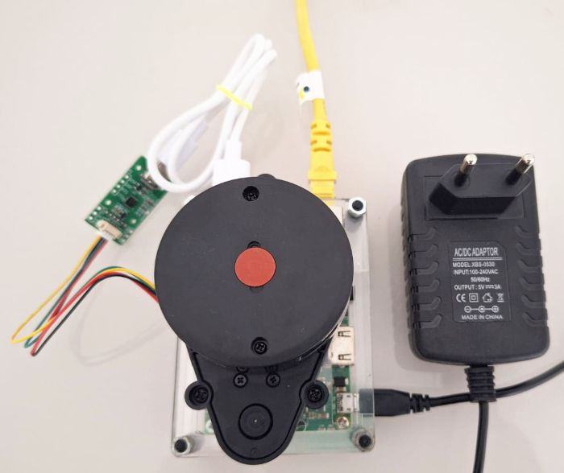

# LiDAR-experiments
Learning Path for LiDAR usage and its possibilities in conjunction with another sensors

## Summary

* [1. Lidar 360º - LD14P Presentation](#section-1)
* [2. Installation and run the ROS publisher via USB](#section-2)
* [3. Instalation in Raspberry via GPIO](#section-3)
* [4. Get data with ROS subscriber](#section-4)
* [5. Using ROS Rviz for visualization](#section-5)
* [6. Combining with inertial sensor](#section-6)


## <a name="section-1"></a> 1. Lidar 360º - LD14P Presentation


There are a lot of 360° LIDAR out there, RoboPeak Team started make low cost ones and get its name popularized in some models like RP Lidar A1 series from SLAMTEC. In general, you will have to follow the manufacturer instructions to have it running. Some times, some instructions are the same for different 360° LiDARs. 

The LD14P claims it's a short distance 360º LiDAR, whith 2-8Hz(default 6Hz), minimum measure distance of 0.1m, range of 6-8m dependig on if its black or white, support for ROS1, ROS2, Python routines that run on Ubuntu and Windows.

## <a name="section-2"></a> 2. Installation and run the ROS publisher via USB



Requirements:

* LD14P 360º LiDAR
* Raspiberry Pi model 3b
* Sd card with [2023-02-09-ubiquity-base-focal-raspberry-pi.img](https://learn.ubiquityrobotics.com/noetic_pi_image_downloads) installed
* Power supply 5V - 3A
* Internet connection plugged in via Ethernet cable (only initial steps)

### SSH connection to Raspberry pi

With this Ubiquity image, the wifi adapter of the Raspberry Pi acts as an Access Point, so we just need to enter `ubiquityrobotXXXX` network, where XXXX is part of the MAC address. The password is `robotseverywhere`. The sudo username is `ubuntu` with password `ubuntu`. 

In this network, just run on a shell:

```shell
ssh ubuntu@10.42.0.1
```

Enter the `ubuntu` password to get inside the Raspberry shell. Now, we can check all IP addresses with:

```shell
ubuntu@ubiquityrobot:~$ ip a | grep "inet "
    inet 127.0.0.1/8 scope host lo
    inet 192.168.1.20/24 brd 192.168.1.255 scope global enxb827ebe94c24
    inet 10.42.0.1/24 brd 10.42.0.255 scope global noprefixroute wlan0
```

Now you can disconnect from `ubiquityrobotXXXX` network, connect back to your own router network to continue accessing internet and SSH again with this other IP received by Raspberry from your router, in this case:

```shell
ssh ubuntu@192.168.1.20
```

It's a good practice to force the same IP received by the Pi. Just create a file like this one below, change the name of the network adapter, DNS and gateway to match your network. 

```shell
ubuntu@ubiquityrobot:~$ cat /etc/netplan/01-netcfg.yaml 
network:
    version: 2
    renderer: networkd
    ethernets:
        enxb827ebe94c24:
            dhcp4: no
            addresses:
                - 192.168.1.20/24
            gateway4: 192.168.1.1
            nameservers:
                addresses: [8.8.8.8,1.1.1.1]
```

### Check LiDAR USB port

Plug and unplug the LiDAR from USB port to check if the device is been recognized. In general, when plugged it starts spinning.

```shell
ubuntu@ubiquityrobot:~$ lsusb
Bus 001 Device 005: ID 1a86:55d4 QinHeng Electronics 
...
```

We also need to know the device full path name. For this, generate a file with the list of devices before and after pluggin the LiDAR. 

```shell
# Unplug Device
ubuntu@ubiquityrobot:~$ ls /dev > nolidar
# Plug Device
ubuntu@ubiquityrobot:~$ ls /dev > withlidar
# Check the differences
ubuntu@ubiquityrobot:~$ diff withlidar nolidar 
69d68
< serial
140d138
< ttyACM0
```

So, in this case, the device full path is `/dev/ttyACM0`.

### Install manufacturers drivers

Another good thing about this Ubiquity image is that it already comes with ROS Noetic pre installed. Ros is a publisher/subscriber system to enable communication with various manufactures devices.

```shell
ubuntu@ubiquityrobot:~$ 
cd ~ && mkdir -p ldlidar_ros_ws/src

cd ldlidar_ros_ws/src && git clone  https://github.com/ldrobotSensorTeam/ldlidar_sl_ros.git

chmod 777 /dev/ttyACM0

cd ~/ldlidar_ros_ws && sed -i 's/ttyUSB0/ttyACM0/' src/ldlidar_sl_ros/launch/ld14p.launch 

cd ~/ldlidar_ros_ws && rosdep install --from-paths src --ignore-src -r -y

cd ~/ldlidar_ros_ws && catkin_make

cd ~/ldlidar_ros_ws && source devel/setup.bash

echo "source ~/ldlidar_ros_ws/devel/setup.bash" >> ~/.bashrc
```

From now on you can run the publisher just by:

```shell
ubuntu@ubiquityrobot:~$ roslaunch ldlidar_sl_ros ld14p.launch
... logging to /home/ubuntu/.ros/log/c0943ed8-7154-11ef-a454-b827ebe94c24/roslaunch-ubiquityrobot-1118.log
Checking log directory for disk usage. This may take a while.
Press Ctrl-C to interrupt
Done checking log file disk usage. Usage is <1GB.

started roslaunch server http://ubiquityrobot.local:42485/

SUMMARY
========

PARAMETERS
 * /ldlidar_publisher_ld14/angle_crop_max: 225.0
 * /ldlidar_publisher_ld14/angle_crop_min: 135.0
 * /ldlidar_publisher_ld14/enable_angle_crop_func: False
 * /ldlidar_publisher_ld14/frame_id: base_laser
 * /ldlidar_publisher_ld14/laser_scan_dir: True
 * /ldlidar_publisher_ld14/laser_scan_topic_name: scan
 * /ldlidar_publisher_ld14/point_cloud_2d_topic_name: pointcloud2d
 * /ldlidar_publisher_ld14/port_name: /dev/ttyACM0
 * /ldlidar_publisher_ld14/product_name: LDLiDAR_LD14P
 * /ldlidar_publisher_ld14/serial_baudrate: 230400
 * /rosdistro: noetic
 * /rosversion: 1.15.15

NODES
  /
    base_to_laserLD14 (tf/static_transform_publisher)
    ldlidar_publisher_ld14 (ldlidar_sl_ros/ldlidar_sl_ros_node)

ROS_MASTER_URI=http://ubiquityrobot:11311

process[ldlidar_publisher_ld14-1]: started with pid [1133]
process[base_to_laserLD14-2]: started with pid [1139]
[ INFO] [1726181935.777882190]: LDLiDAR SDK Pack Version is:3.0.5
[ INFO] [1726181935.785446947]: ROS param input:
[ INFO] [1726181935.785777883]: <product_name>: LDLiDAR_LD14P
[ INFO] [1726181935.785948560]: <laser_scan_topic_name>: scan
[ INFO] [1726181935.786070330]: <point_cloud_2d_topic_name>: pointcloud2d
[ INFO] [1726181935.786213090]: <frame_id>: base_laser
[ INFO] [1726181935.786383454]: <port_name>: /dev/ttyACM0
[ INFO] [1726181935.786561109]: <serial_baudrate>: 230400
[ INFO] [1726181935.786703556]: <laser_scan_dir>: Counterclockwise
[ INFO] [1726181935.786872878]: <enable_angle_crop_func>: false
[ INFO] [1726181935.787040378]: <angle_crop_min>: 135.000000
[ INFO] [1726181935.787196262]: <angle_crop_max>: 225.000000
[LDS][INFO][1726181935.788788807][Actual BaudRate reported:230400]
[ INFO] [1726181935.789439846]: ldlidar driver start is success
[ INFO] [1726181935.797392987]: ldlidar communication is normal.
[ INFO] [1726181935.814503065]: start normal, pub lidar data
```

## <a name="section-3"></a> 3. Instalation in Raspberry via GPIO

## <a name="section-4"></a> 4. Get data with ROS subscriber

## <a name="section-5"></a> 5. Using ROS Rviz for visualization

## <a name="section-6"></a> 6. Combining with inertial sensor
